# Phase 140: Bounded Operational Loose-End Triage - Research

**Researched:** 2026-09-28  
**Domain:** Repository maintenance evidence, Git/GitHub triage, dependency review, and exact-SHA CI/release acceptance  
**Confidence:** MEDIUM

<user_constraints>
## User Constraints (from CONTEXT.md)

### Implementation Decisions

### One Traceable Disposition Record
- **D-01:** Create one authoritative Phase 140 Markdown disposition record referencing stable Phase 138 evidence IDs and canonical source paths or URLs. Preserve the original Phase 138 inventory as immutable observed evidence; do not rewrite it to make proposals appear executed.
- **D-02:** Assign each credible maintained finding exactly one supported disposition: `fix-now`, `defer-with-trigger`, `retain-historical`, `already-resolved`, or `out-of-scope`. Deduplicate repeated mentions while preserving their references. Keep domain-native Git/PR/issue dispositions alongside the finding disposition where applicable.
- **D-03:** Record the evidence, rationale, current target identity, next proof or recheck trigger, and proposed-versus-executed state. A fix or resolved claim requires terminal evidence; historical means intentionally retained. A healthy baseline does not require an empty queue or deleted history.

### Revalidate Before Action
- **D-04:** Refresh evidence at the authorized Phase 140 inventory boundary and validate its relationship to the preserved snapshot before relying on proposals. Incomplete evidence, identity mismatch, or `refresh_required` cannot be treated as current action authority. Reuse the existing collector and relation controls; research the bounded refresh path before implementation.
- **D-05:** Immediately before any inventory action, revalidate its exact target, current state, existing authority, recovery path, worktree safety, and historical-evidence safety. Preserve uncommitted work and intentional refs. Defer a changed or inadequately supported target with the missing proof and trigger recorded.
- **D-06:** Confirmation of this context locks the decision framework; it does not itself authorize deleting a particular branch, tag, or worktree, merging or closing a particular GitHub item, or publishing a release. Apply authority already established for a concrete action and seek additional authority only where genuinely missing.

### Finite Evidence-Led Triage
- **D-07:** Review the nine archived v1.32/v1.27 UAT records as candidates against current behavior and evidence. Preserve their existing out-of-scope or deferred dispositions unless current evidence supports changing them. Do not replay completed phase plans or convert historical notes into mandatory new work.
- **D-08:** Include demonstrated maintained-record contradictions as bounded candidates, such as Phase 139's inconsistent roadmap plan counts and stale current-state prose. Reconcile only claims contradicted by current evidence; preserve historical records and pre-existing local edits.
- **D-09:** Fix only current blockers, regressions, contradictions, stale actionable artifacts, and small high-confidence maintenance gaps. Defer speculative, feature-sized, or insufficiently evidenced work with a concrete trigger. Stop when the finite refreshed set of credible findings has supported dispositions, selected bounded fixes have proof, and required acceptance passes.
- **D-10:** Reuse existing repository controls. Add or tighten recurring automation only for a demonstrated repeatable repository-owned gap; avoid another maintenance framework or new product/runtime surface.

### Individual Dependency Evidence and Final Acceptance
- **D-11:** Assess each current dependency-update PR independently for compatibility, security, and required repository gates. Refresh the PR's actual version change, target identity, and check results; dated inventory rows and another PR's green checks are insufficient. Research current upstream compatibility and security evidence for the specific package/version under consideration.
- **D-12:** Use focused automated checks at the earliest useful point for selected repairs. Reuse existing unit, integration, contract, smoke, and seam checks; add recurring CI proof only where reliable and valuable. Reliable executable evidence satisfies verification without an unnecessary human UAT handoff.
- **D-13:** Close CI-06 and CI-07 against the resulting synchronized final `main` SHA, with required canonical CI and a successful intentional Release no-publish outcome for that same SHA. Bind local `mix ci` and hygiene evidence through the existing acceptance path; retain an explicit disposition for each hygiene `WARN` and no unresolved `BLOCK`.
- **D-14:** The recorded Phase 140 entry receipt is dated proof for its exact SHA, not blanket acceptance of later state. Preserve the blocking `plan:pre` contract and revalidate through its supported lifecycle. Keep supplemental OIDF/FAPI findings redacted and non-certifying, separate from required acceptance; preserve the historical 1.5.0 release chain and Release Please/protected publishing ownership.

### the agent's Discretion
The user confirmed the complete recommendation bundle without corrections. Planning may choose the disposition filename and compact table layout, bounded task grouping, focused test selectors, and internal helper details. Those choices must preserve stable references, explicit authority, finite scope, current proof, existing release ownership, and the distinction between observed, proposed, and executed work. Fresh research is the selected next planning step.

### Deferred Ideas (OUT OF SCOPE)
- Final dated milestone-baseline publication and return to the sustaining GA release train belong to Phase 141.
- Supplemental OIDF/FAPI remediation remains future bounded conformance work unless current evidence demonstrates a narrowly scoped repository regression.
- Broad dependency refresh, speculative refactoring, protocol/host/admin expansion, maintenance dashboards/frameworks, destructive bulk cleanup, and manual release publication remain outside this phase.
- No pending todos matched Phase 140 during discussion; no additional todos were folded into scope.
</user_constraints>

<phase_requirements>
## Phase Requirements

| ID | Description | Research Support |
|----|-------------|------------------|
| CI-06 | Maintainer can prove all required repo-owned CI checks pass for the exact synchronized final `main` SHA. | Existing hygiene acceptance validates canonical workflow identity, exact SHA, complete required job set, synchronized `main`, and CI results. `[VERIFIED: .planning/REQUIREMENTS.md:25]` |
| CI-07 | Maintainer can prove the release workflow is successful or intentionally skipped/no-op for that same baseline without publishing or manually changing release-owned files. | Existing exact-acceptance path checks the same-SHA Release workflow and its intentional no-publish job graph; Release Please and protected publication ownership remain authoritative. `[VERIFIED: .planning/REQUIREMENTS.md:26]` |
| BASE-03 | Maintainer can perform only authorized, exact-target cleanup without deleting uncommitted work, intentional refs, or historical release evidence. | Phase 138 inventory is proposal-only; revalidate exact target, authorization, recovery path, working-tree projection, and historical-release references immediately before any action. `[VERIFIED: .planning/REQUIREMENTS.md:15]` |
| TRIAGE-03 | Maintainer can evaluate each dependency-update PR independently against compatibility, security, and required repository gates rather than treating updates as a bulk campaign. | Six open dependency PRs were observed with distinct package/version changes, head/base SHAs, and historic individual check results; upstream sources reveal package-specific compatibility/security checks to perform. `[VERIFIED: .planning/REQUIREMENTS.md:21]` |
| LOOSE-02 | Maintainer can assign each credible finding exactly one evidence-backed disposition: fix now, defer with a trigger, retain as historical evidence, already resolved, or out of scope. | Create a single record joined to stable Phase 138 REC IDs and source-native IDs; keep one disposition per finding plus a separate proposed/executed status and terminal proof. `[VERIFIED: .planning/REQUIREMENTS.md:44]` |
| LOOSE-03 | Maintainer can close blockers, regressions, contradictions, stale actionable artifacts, and small high-confidence maintenance gaps while excluding speculative or feature-sized work. | Current code/release proof identifies bounded candidates and resolves some prior work; compare the finite refreshed candidate set to current behavior and use focused existing regression seams. `[VERIFIED: .planning/REQUIREMENTS.md:45]` |
</phase_requirements>

## Summary

Plan Phase 140 around Lockspire's existing repository-local collector, relation verifier, hygiene acceptance, and finalizer. The phase has no new product or runtime stack. Preserve Phase 138's immutable evidence; its read-only relation check on 2026-09-28 returned `refresh_required` because branch topology and working-tree state no longer matched the recorded snapshot. A refreshed evidence ledger is needed before its proposed inventory rows can support new actions. `[VERIFIED: scripts/maintainer/baseline_inventory.sh:414-423,4684-4713]` `[VERIFIED: live read-only relation output 2026-09-28]`

The current local `main`, `origin/main`, and HEAD are synchronized at `c6332d3a8b716b938f93d978243281764e3eac41`; the durable Phase 139 receipt and GitHub show CI run `36476762461` succeeded and Release run `36476762490` succeeded with publication jobs skipped. The same SHA already contains the bounded Mint advisory update and inventory-timeout repair, so assess those as resolved candidates rather than planning duplicates. The worktree still contains modified Phase 138 UAT/verification files and an untracked roadmap prompt; preserve these exact edits. `[VERIFIED: .git/lockspire-phase-139-acceptance-v1.json]` `[VERIFIED: live GitHub workflow runs 36476762461 and 36476762490, 2026-09-28]` `[VERIFIED: git status and commits 4a745024, c6332d3a, 2026-09-28]`

**Primary recommendation:** Build a finite, source-linked disposition record, refresh the current inventory through its existing boundary, then assess each live dependency PR and any selected small repair independently. Keep action authority explicit and finish required CI/Release acceptance against one exact synchronized final SHA. Current evidence is time-sensitive; query identities, checks, advisories, and refs again at the point of action. `[VERIFIED: .planning/phases/140-bounded-operational-loose-end-triage/140-CONTEXT.md:20-38]`

## Architectural Responsibility Map

| Capability | Primary Tier | Secondary Tier | Rationale |
|------------|-------------|----------------|-----------|
| Inventory collection and snapshot relation | Repository tooling | Git/GitHub | Existing Bash collector owns collection and immutable snapshot validation; Git and GitHub are evidence sources. `[VERIFIED: scripts/maintainer/baseline_inventory.sh:100-120,414-423]` |
| Finding disposition record | Planning documentation | Maintainer | One Markdown record joins immutable inventory IDs to current proof and makes proposed/executed state explicit. `[VERIFIED: Phase 140 CONTEXT D-01–D-03]` |
| Exact cleanup and PR actions | Maintainer / GitHub | Repository tooling | Scripts verify evidence and gates; context decisions do not authorize individual destructive or merge actions. `[VERIFIED: Phase 140 CONTEXT D-05–D-06]` |
| Required acceptance | Repository tooling / GitHub Actions | GitHub API | Existing hygiene script binds local gates, workflow identities, same SHA, and job outcomes; workflows remain required sources. `[VERIFIED: scripts/maintainer/repo_hygiene_check.sh:326-430,434-474]` |

## Project Constraints (from AGENTS.md)

- “Build Lockspire as a separate companion library, not a Sigra module.” `[VERIFIED: AGENTS.md:17]`
- “Preserve the embedded-library shape; do not turn this into a required standalone auth service.” `[VERIFIED: AGENTS.md:18]`
- “Keep strong internal boundaries between protocol core, storage, generators, Plug/Phoenix integration, and LiveView/admin surfaces.” `[VERIFIED: AGENTS.md:19]`
- “Treat the host seam as explicit and narrow: account resolution, claims, login redirects, branding, and product policy belong to the host app.” `[VERIFIED: AGENTS.md:20]`
- “Do not broaden v1 into SAML, LDAP/AD federation, hosted auth, or a full CIAM suite.” `[VERIFIED: AGENTS.md:21]`
- Preserve the exact security defaults: “PKCE S256 required by default”; “Exact-match redirect URI validation”; “Client secrets hashed at rest”; “Authorization codes short-lived and single-use”; “Refresh token rotation with family-wide revocation on reuse”; “No implicit flow”; “No `alg=none`”; “Strong redaction in logs and operator surfaces.” `[VERIFIED: AGENTS.md:43-50]`

The project skill directories `.agents/skills/` and `.codex/skills/` are absent, so no project-specific skill rules apply. `[VERIFIED: project-skill directory probe 2026-09-28]`

## Standard Stack

This is repository maintenance work: reuse the current scripts and CI rather than adding runtime libraries.

### Core

| Tool | Version observed | Purpose | Why standard |
|------|------------------|---------|--------------|
| Bash | Existing repository scripts | Inventory, hygiene, and finalizer entry points | These existing tools implement the required proposal-only and exact-acceptance lifecycle. `[VERIFIED: scripts/maintainer/baseline_inventory.sh:100-120; scripts/maintainer/repo_hygiene_check.sh:19-39]` |
| Git | 2.41.0 | Exact refs, ancestry, worktree, and snapshot identity | The collector uses Git refs and ancestry as the canonical local repository evidence. `[VERIFIED: scripts/maintainer/baseline_inventory.sh:1108-1145,4684-4713]` `[VERIFIED: git --version 2026-09-28]` |
| GitHub CLI (`gh`) | 2.101.0 | Read current PRs, checks, and Actions runs | The existing exact-acceptance script reads workflow metadata, runs, and jobs from GitHub APIs. `[VERIFIED: scripts/maintainer/repo_hygiene_check.sh:326-430]` `[VERIFIED: gh --version 2026-09-28]` |
| jq | 1.7.1 | Validate structured receipts and workflow responses | Required by collector and exact acceptance. `[VERIFIED: scripts/maintainer/baseline_inventory.sh:5256-5258]` `[VERIFIED: jq --version 2026-09-28]` |
| Python 3 | 3.14.4 | Existing atomic receipt and finalizer helpers | Reuse project helpers; do not add a package for this phase. `[VERIFIED: scripts/maintainer/finalize_phase_139_acceptance.sh:140-180]` `[VERIFIED: python3 --version 2026-09-28]` |
| Elixir/Mix | Project declares `elixir: "~> 1.18"`; shell has no selected version | Focused ExUnit checks and `mix ci` | Project aliases define the local verification path. CI declares `MIN_ELIXIR_VERSION: "1.18.4"` and `MIN_OTP_VERSION: "27"`. Select the supported asdf version before local gates or rely on current CI evidence until available. `[VERIFIED: mix.exs:14,147-155]` `[VERIFIED: .github/workflows/ci.yml:17-21]` `[VERIFIED: mix --version 2026-09-28]` |

### Supporting

| Tool | Version observed | Purpose | When to use |
|------|------------------|---------|-------------|
| Node.js | 22.14.0 | Run existing GSD finalizer lifecycle contract tests | Only if a selected repair touches the finalizer or its lifecycle. `[VERIFIED: node --version and tools/gsd-capabilities/lockspire-phase-finalizer/lockspire-finalize-lifecycle.test.cjs]` |
| GitHub Actions | Current runs observed for exact `main` SHA | Required canonical CI and Release no-publish proof | Final acceptance only; PR branch checks are not transferable to another SHA. `[VERIFIED: live workflow runs 36476762461 and 36476762490, 2026-09-28]` |

**Installation:** None. No external package installation is required to write the disposition record or use existing controls. The package candidates below are existing pull requests, not recommended new dependencies.

**Package legitimacy audit:** Not required; the phase adds no external package installation.

## Current Evidence and Candidate Inputs

The Phase 138 ledger is immutable and still useful for stable IDs, but it no longer authorizes current conclusions. Running the read-only relation command returned `snapshot_relation: refresh_required`; the output identifies branch mismatch and a changed working-tree projection. The supported collection CLI accepts a selected output path, but collection itself runs `git fetch --prune --tags` and publishes a new ledger. Do not treat relation inspection as collection or cleanup. `[VERIFIED: scripts/maintainer/baseline_inventory.sh:100-120,414-423,1108-1118,5296-5314]` `[VERIFIED: relation command output 2026-09-28]`

There are six currently open dependency-update PRs. Their recorded base SHAs are older than current `main`; check results below are dated branch results, not current action authority. Re-query each exact head/base SHA and every check before making a disposition. `[VERIFIED: authenticated gh pr list/view results 2026-09-28]`

| PR | Candidate change | Observed head SHA | Existing check evidence | Planning-specific review |
|----|------------------|-------------------|-------------------------|--------------------------|
| [#98](https://github.com/szTheory/lockspire/pull/98) | Oban 2.21.1 → 2.24.0 | `e222c4a8ef53e130f3816fbc0de04bb5d744da87` | Old CI has several failures; dependency review passed. | Review actual app config, migration state, upstream changes, refreshed target, and every required check. Oban 2.24 reorganizes configuration with stated compatibility shims; it still merits config-specific review. `[CITED: github.com/oban-bg/oban/releases/tag/v2.24.0]` |
| [#97](https://github.com/szTheory/lockspire/pull/97) | Phoenix LiveView 1.2.10 → 1.2.11 | `fda85ec9e0bde759e7f6272cbbb0c3f2aa1bb91d` | Historical check set was green except Release Hygiene Drift. | Compare patched version against current Phoenix LiveView advisories, actual host-facing call sites, current target version, and refreshed checks. Official advisories describe issues affecting versions earlier than 1.2.9 / 1.2.7; confirm exact candidate coverage. `[CITED: github.com/phoenixframework/phoenix_live_view/security/advisories]` |
| [#96](https://github.com/szTheory/lockspire/pull/96) | Req 0.7.1 → 0.7.4 | `0e163d6bca876406daec00869b14de5fd635e2ec` | Historical dependency review and multiple CI checks failed. | Inspect Req call sites and resolve the current dependency-review failure before considering; v0.7.4 changes query/path parameter behavior. `[CITED: github.com/wojtekmach/req/releases/tag/v0.7.4]` |
| [#91](https://github.com/szTheory/lockspire/pull/91) | `actions/setup-python` 6.0.0 → 7.0.0 | `3c7049a55c4aa2d0f6e3558a2aeb8d7162591c48` | Old check set has failures. | The diff only changes three OIDF workflow pins and preserves full-SHA action pins. Confirm runner Node 24 support and refreshed OIDF behavior; its results remain supplemental. `[VERIFIED: gh pr diff 91, 2026-09-28]` `[CITED: github.com/actions/setup-python]` |
| [#88](https://github.com/szTheory/lockspire/pull/88) | Sobelow 0.14.1 → 0.15.0 | `3e3cac4cbf300a49e011020f6247a97dd81f8ccb` | Historical check set has failures. | Inspect the exact failure and whether new scan behavior changes `.sobelow-conf` handling or baseline findings; run relevant CI checks against a fresh head. `[CITED: github.com/sobelow/sobelow/releases/tag/v0.15.0]` |
| [#87](https://github.com/szTheory/lockspire/pull/87) | Postgrex 0.22.3 → 0.22.4 | `4161579c3ceed38d44f864102fc4decb07467438` | Historical check set has failures. | Evaluate CVE-2026-66838 exposure in `Postgrex.stream/4`, package compatibility, dependency review, and refreshed required checks. `[CITED: github.com/elixir-ecto/postgrex/blob/master/CHANGELOG.md]` |

The mainline Mint update is already present at commit `4a74502409d9f21114283d444a5b1187cb3d6b1b`; the timeout repair is at `c6332d3a8b716b938f93d978243281764e3eac41`. Treat their exact commits/tests as terminal proof for those particular findings if they appear again in the refreshed inventory. `[VERIFIED: git show --stat and git show of commits 4a745024 and c6332d3a, 2026-09-28]`

## Architecture Patterns

### System Architecture Diagram

```mermaid
flowchart LR
  A[Prior immutable inventory and maintained records] --> B[Read-only relation and identity checks]
  B -->|current evidence| C[Refresh bounded Git, GitHub, and record evidence]
  B -->|refresh_required or partial| C
  C --> D[Join stable IDs to current target and source proof]
  D --> E{Evidence-backed disposition?}
  E -->|fix-now / authorized action| F[Revalidate target, authority, recovery, and worktree]
  E -->|defer / historical / resolved / out-of-scope| G[Record trigger, rationale, source, and status]
  F --> H[Focused repair or exact action]
  H --> I[Focused checks and terminal proof]
  G --> J[One traceable disposition record]
  I --> J
  J --> K[Same-SHA required CI and Release no-publish acceptance]
  K --> L[Phase 141 baseline handoff]
```



### Recommended Project Structure

Keep changes in existing maintenance seams; create one Phase 140 Markdown disposition record under `.planning/phases/140-bounded-operational-loose-end-triage/`. Do not add a new `lib/` module, product API, or maintenance subsystem. `[VERIFIED: AGENTS.md:16-21]` `[VERIFIED: Phase 140 CONTEXT D-01, D-10]`

### Pattern 1: Immutable evidence plus current relation

**What:** Preserve the Phase 138 snapshot and use its stable IDs, while separately refreshing mutable Git/GitHub/record evidence. A relation result of `refresh_required` invalidates it as current action evidence. `[VERIFIED: scripts/maintainer/baseline_inventory.sh:414-423,4684-4713]`

**When to use:** Before relying on inventory proposals, then again at the individual action boundary.

**Example:**

```bash
# Read-only relation inspection; a nonzero result or refresh_required blocks use as current authority.
bash scripts/maintainer/baseline_inventory.sh \
  --verify-snapshot-relation .planning/phases/138-baseline-inventory-evidence-taxonomy/baseline-inventory-2026-08-28.md

# For a new collection, choose a reviewed exact output path in an existing directory.
# Collection refreshes origin metadata and writes evidence; it is not a read-only check.
bash scripts/maintainer/baseline_inventory.sh --output <reviewed-ledger-path>
```

The Phase 138 ledger path shown above is the collector's declared `CANONICAL_LEDGER_RELATIVE_PATH`; `--verify-snapshot-relation LEDGER` accepts an explicit ledger path, but the rendered snapshot footer still prints that canonical path. If a noncanonical refreshed ledger is chosen, verify how its recheck instructions will be recorded. `[VERIFIED: scripts/maintainer/baseline_inventory.sh:83,100-120,414-423,5240-5273]`

### Pattern 2: Exact-SHA acceptance

**What:** Validate the exact synchronized SHA against the canonical CI workflow and complete required job graph, then validate successful Release with protected publication jobs intentionally skipped. `[VERIFIED: scripts/maintainer/repo_hygiene_check.sh:326-430,434-474]`

**When to use:** At phase exit, after all selected changes are on final synchronized `main`.

**Example:**

```bash
bash scripts/maintainer/repo_hygiene_check.sh \
  --accept-sha <full-lowercase-40-hex-sha> \
  --warn-disposition <observed-label>=<explicit-disposition> \
  --format json
```

The exact-acceptance path requires local mode, `mix ci`, and JSON output, validates each warning label, and requires zero unresolved blocks. `[VERIFIED: scripts/maintainer/repo_hygiene_check.sh:148-170,476-510,1037-1049]`

### Pattern 3: One row per credible finding, one PR at a time

**What:** Link a single Phase 140 disposition to stable Phase 138 IDs and source-native references; preserve a domain-native PR/ref disposition separately. For dependency PRs, bind version delta, exact head/base, compatibility/security evidence, and required check results to that PR's own row. `[VERIFIED: Phase 140 CONTEXT D-01–D-03,D-11]`

**When to use:** For the refreshed candidate inventory and all dependency-update PRs.

**Example row shape:**

```markdown
| REC ID / source ID | Finding | target SHA or current identity | disposition | evidence + rationale | trigger / next proof | state | domain-native disposition |
```

Use exactly one finding disposition per row: the requirements quote the values “fix now, defer with a trigger, retain as historical evidence, already resolved, or out of scope.” `[VERIFIED: .planning/REQUIREMENTS.md:41-45]`

### Anti-Patterns to Avoid

- Rewriting Phase 138 inventory rows to make proposed work look completed; keep observations immutable. `[VERIFIED: Phase 140 CONTEXT D-01]`
- Reusing another PR's green checks, a stale check rollup, or old baseline identity as this PR's current assessment. `[VERIFIED: Phase 140 CONTEXT D-11; current gh pr view results 2026-09-28]`
- Treating OIDF/FAPI supplemental results as required certification or final acceptance. `[VERIFIED: Phase 140 CONTEXT D-14; .planning/REQUIREMENTS.md:25-27]`
- Cleaning refs, worktrees, or historical release artifacts based on age or an aggregate cleanliness goal. Revalidate exact target and authority first. `[VERIFIED: Phase 140 CONTEXT D-05–D-06]`

## Don't Hand-Roll

| Problem | Don't Build | Use Instead | Why |
|---------|-------------|-------------|-----|
| Git/GitHub evidence collection and stable IDs | A new scanner, crawler, or identity scheme | `scripts/maintainer/baseline_inventory.sh` | It already collects scoped sources, tracks completeness, and provides relation checks. `[VERIFIED: scripts/maintainer/baseline_inventory.sh:100-120,414-423]` |
| Exact acceptance and WARN handling | A second CI/Release checker | `scripts/maintainer/repo_hygiene_check.sh --accept-sha ... --format json` | It validates workflow identity, exact SHA, required jobs, no-publish Release outcome, and explicit WARN dispositions. `[VERIFIED: scripts/maintainer/repo_hygiene_check.sh:326-430,434-510]` |
| Phase gate / receipt lifecycle | Another hook or push route | `tools/gsd-capabilities/lockspire-phase-finalizer/` and its supported CLI | The capability owns the blocking `plan:pre` lifecycle; keep its contract. `[VERIFIED: tools/gsd-capabilities/lockspire-phase-finalizer/capability.json:29-53]` |
| Dependency vulnerability scanning | Custom CVE comparison code | Existing `mix deps.audit`, `mix hex.audit`, GitHub dependency review, plus authoritative upstream advisories | Existing `mix ci` runs audits; dependency review fails closed if the graph is unavailable. `[VERIFIED: mix.exs:143-155; .github/workflows/dependency-review.yml:14-41]` |

**Key insight:** The hard problem is evidence freshness and action authority, not a missing maintenance framework. Keep observations, proposed disposition, executed state, and terminal evidence distinct. `[VERIFIED: Phase 140 CONTEXT D-01–D-05,D-10]`

## Common Pitfalls

### Pitfall 1: Treating a dated snapshot as current

**What goes wrong:** A stale or partial inventory gets used to approve cleanup or an issue/PR action.  
**Why it happens:** A valid historical snapshot and current working state are easy to conflate.  
**How to avoid:** Run the read-only relation check; on `refresh_required`, recollect under the authorized boundary and verify the new relation before relying on it.  
**Warning signs:** `refresh_required`, incomplete receipts, changed branch topology, mismatched head/base identity, or changed working-tree projection. `[VERIFIED: scripts/maintainer/baseline_inventory.sh:414-423,4684-4713]`

### Pitfall 2: Losing or laundering pre-existing work

**What goes wrong:** A collector overwrite or cleanup changes files/refs that were not part of the authorized target.  
**Why it happens:** Worktree state and target identity are checked too early or incompletely.  
**How to avoid:** Record exact paths and ref identities, recovery evidence, and historical-release links; revalidate immediately before action. Defer changed targets.  
**Warning signs:** Any changed path beyond the named target, uncommitted work omitted from the projection, or ambiguity around intentional refs. `[VERIFIED: Phase 140 CONTEXT D-05–D-06]`

### Pitfall 3: Bulk dependency reasoning

**What goes wrong:** One passing dependency PR or older green check is used to accept another candidate.  
**Why it happens:** The candidates share a Dependabot queue but have different package behaviors and target SHAs.  
**How to avoid:** Re-fetch every PR's files, head/base identity, dependency-review outcome, required checks, and package-specific upstream advisories at decision time.  
**Warning signs:** Stale base SHAs, incomplete checks, dependency-graph failure, or version evidence that does not name this candidate. `[VERIFIED: Phase 140 CONTEXT D-11; .github/workflows/dependency-review.yml:18-41]`

### Pitfall 4: Turning archive notes into new work

**What goes wrong:** Historical UAT notes are replayed as current defects or treated as fresh implementation requirements.  
**Why it happens:** Archived audit and deferred-item documents mix old failures, out-of-scope work, and follow-up triggers.  
**How to avoid:** Preserve each source disposition until current code/evidence supports changing it; map the nine requested candidates to exact archived records and stable IDs. Do not replay completed plans.  
**Warning signs:** A finding lacks a current reproduction, terminal proof, named trigger, or canonical archive path. `[VERIFIED: Phase 140 CONTEXT D-07; .planning/milestones/v1.27-MILESTONE-AUDIT.md:90-113; .planning/milestones/v1.32-MILESTONE-AUDIT.md:120-128]`

### Pitfall 5: Fixing a record contradiction with an unsupported claim

**What goes wrong:** Phase 139 history gets rewritten or current prose is changed without checking source PLAN/SUMMARY pairs.  
**Why it happens:** The roadmap's phase detail says “9/11 plans executed” while its progress table says “13/13”; one line is historical context, one may be stale current progress.  
**How to avoid:** Count the actual Phase 139 plan/summary pairs and inspect verification evidence before changing only the contradicted current-state claim. `[VERIFIED: .planning/ROADMAP.md:154,230; .planning/phases/139-required-truth-reconciliation/139-VERIFICATION.md:122-129]`

## Code Examples

These are repository command patterns; no new application code is indicated.

### Refresh a PR assessment

```bash
gh pr view <number> \
  --json number,title,url,headRefOid,baseRefOid,files,statusCheckRollup,mergeStateStatus,reviewDecision
```

Bind the observed fields to one PR row and re-run after its head changes. `[VERIFIED: read-only authenticated gh pr view of PRs 87, 88, 91, 96, 97, 98 on 2026-09-28]`

### Exact acceptance after the final SHA is established

```bash
mix ci
bash scripts/maintainer/repo_hygiene_check.sh \
  --accept-sha <exact-synchronized-main-sha> \
  --warn-disposition <label>=<disposition> \
  --format json
```

Run with each actual WARN label from the preceding hygiene report; never invent a label or claim acceptance from a prior SHA. `[VERIFIED: scripts/maintainer/repo_hygiene_check.sh:81-99,148-170,476-510]`

## State of the Art

| Prior approach | Current approach | When changed | Impact |
|---------------|------------------|--------------|--------|
| Use the Phase 138 snapshot as the queue's current status | Keep Phase 138 as immutable identity/evidence; refresh mutable Git/GitHub state and check the relation | Current relation check on 2026-09-28 | Existing snapshot currently requires refresh before action proposals can be relied upon. `[VERIFIED: read-only relation result 2026-09-28]` |
| Treat multiple Dependabot PRs as one update batch | Assess each head/base, package change, security evidence, and check graph independently | Locked decision D-11, 2026-09-27 | Green checks or compatibility evidence do not transfer across PRs. `[VERIFIED: Phase 140 CONTEXT D-11]` |
| Infer phase completion from a summary table | Reconcile the contradictory roadmap values against actual PLAN/SUMMARY pairs and verification record | Current Phase 139 files | The roadmap detail and progress row currently disagree; exact source counts determine the bounded edit. `[VERIFIED: .planning/ROADMAP.md:154,230; Phase 139 VERIFICATION:122-129]` |

**Deprecated/outdated:** A PR's old check status or base SHA is not current proof. Refresh its exact version change, identity, upstream notes/advisories, and required checks before action. `[VERIFIED: Phase 140 CONTEXT D-11; current authenticated PR metadata 2026-09-28]`

## Assumptions Log

| # | Claim | Section | Risk if Wrong |
|---|-------|---------|---------------|
| A1 | The nine archived UAT candidate slots map to specific source records across the v1.27/v1.32 audit, verification, and deferred-item artifacts. | Current Evidence and Candidate Inputs | A wrong mapping could drop stable provenance; planner must identify each exact archived path/source-native ID and retain prior dispositions. |

## Open Questions

1. **Which exact source records make up the nine archived UAT candidates?**
   - What we know: Context fixes nine candidates from archived v1.27/v1.32 records and says to preserve current historical/deferred statuses absent fresh evidence. `[VERIFIED: Phase 140 CONTEXT D-07]`
   - What's unclear: The milestone audits summarize some findings, while detailed deferred items and UAT artifacts are spread across archived phase paths.
   - Recommendation: Resolve nine rows by direct source path and existing stable Phase 138 ID before assigning a new disposition; do not count grouped audit notes as individual defects.
2. **What is the final refreshed inventory path?**
   - What we know: Collector accepts an explicit output path; snapshot relation accepts a ledger argument, but generated explanatory text names the canonical Phase 138 path. `[VERIFIED: scripts/maintainer/baseline_inventory.sh:100-120,414-423,5240-5273]`
   - What's unclear: Whether the final disposition artifact should embed the refreshed ledger path, attach it as an evidence artifact, or use stable REC IDs without a second ledger.
   - Recommendation: Choose the smallest traceable artifact set in the plan and make the recheck command/path explicit; retain the Phase 138 inventory unchanged.

## Environment Availability

| Dependency | Required by | Available | Version | Fallback |
|------------|-------------|-----------|---------|----------|
| Git | Snapshot relation and exact-target review | ✓ | 2.41.0 | — |
| GitHub CLI | Current PRs, checks, and Actions evidence | ✓ | 2.101.0; authenticated read-only queries succeeded | GitHub API only if authenticated identity and exact fields are retained |
| jq | Collector and acceptance | ✓ | 1.7.1 | — |
| Python 3 | Existing receipt/finalizer helpers | ✓ | 3.14.4 | CI Python runtime for remote checks |
| Node.js | Existing GSD lifecycle contracts | ✓ | 22.14.0 | CI Node setup |
| Elixir/Mix | Local ExUnit and `mix ci` | ✗ selected version | `mix --version` reports no version selected; CI declares Elixir `1.18.4`/OTP `27` minimum | Select/install the existing project-supported toolchain before local gates; exact current GitHub CI is available as external evidence |
| GitHub Actions | Required CI/Release proof | ✓ | Current exact-SHA runs available | No local substitute for final same-SHA acceptance |

Read-only probes did not install tools or run tests. `[VERIFIED: tool probes 2026-09-28]` `[VERIFIED: .github/workflows/ci.yml:17-21]`

## Validation Architecture

### Test Framework

| Property | Value |
|----------|-------|
| Framework | ExUnit via Mix; Node built-in test runner for GSD finalizer tooling |
| Config file | `mix.exs`; `.github/workflows/ci.yml`; finalizer contract tests in `tools/gsd-capabilities/lockspire-phase-finalizer/` |
| Quick run command | `mix test test/lockspire/release/release_ci_evidence_contract_test.exs test/lockspire/workflow_supply_chain_contract_test.exs` (requires selected Elixir/OTP and project deps) |
| Full suite command | `mix ci` |

### Phase Requirements → Test Map

| Req ID | Behavior | Test type | Automated command / evidence | File exists? |
|--------|----------|-----------|-----------------------------|--------------|
| CI-06 | Required CI jobs pass for final synchronized SHA | External integration | `bash scripts/maintainer/repo_hygiene_check.sh --accept-sha <sha> --format json` plus exact GitHub run/job identity | Existing hygiene contract and live GitHub API |
| CI-07 | Same-SHA Release succeeds with protected publication jobs skipped | External integration | Same exact-acceptance command and its Release job-graph result | Existing `test/lockspire/release_ci_evidence_contract_test.exs` |
| BASE-03 | Cleanup is authorized and exact target/worktree safe | Contract/manual action evidence | Target-specific revalidation plus reviewed action record; the action itself must match the named target | Existing collector relation and hygiene contracts |
| TRIAGE-03 | Each dependency PR independently assessed | Integration/record review | Current `gh pr view` per PR plus package-specific upstream evidence and refreshed required checks | Existing `test/lockspire/workflow_supply_chain_contract_test.exs` |
| LOOSE-02 | Each credible finding has exactly one supported disposition | Artifact consistency | Review each row against stable REC/source IDs; add a deterministic contract only if selected record structure merits it | Existing maintained-record collector; no Phase 140 disposition-record contract exists yet |
| LOOSE-03 | Bounded current gaps fixed/deferred with proof | Focused test by selected repair | Run nearest existing test first, then `mix ci` | Existing repair-specific tests; selected findings determine exact selector |

### Wave 0 Gaps

- No generic test framework gap is demonstrated. The final disposition table should determine whether a small deterministic record consistency test has value; do not add recurring automation before demonstrating a repeatable repository-owned gap. `[VERIFIED: Phase 140 CONTEXT D-10,D-12]`
- Local Mix is not currently executable because no Elixir version is selected. The finalizer and acceptance flow have CI contracts; do not claim local validation until the existing toolchain is selected. `[VERIFIED: mix --version probe 2026-09-28]`
- No tests were run during research; the current exact-SHA required CI and no-publish Release evidence are available in the durable receipt.

## Security Domain

No OAuth/OIDC endpoint, token flow, or admin surface is in scope. Apply security controls to repository evidence and maintenance actions: exact target identity, explicit authority, fail-closed partial/missing evidence, dependency advisory review, full-SHA action pins, log/redaction boundaries, and no manual release publication. Preserve Lockspire's existing protocol defaults if any selected code repair touches product code. `[VERIFIED: AGENTS.md:43-50; Phase 140 CONTEXT D-05,D-11,D-14; .github/workflows/dependency-review.yml:14-41]`

### Applicable ASVS Categories

| ASVS Category | Applies | Standard Control |
|---------------|---------|-----------------|
| V2 Authentication | No | No product authentication flow is changed. |
| V3 Session Management | No | No session lifecycle is changed. |
| V4 Access Control | Yes, repository operation authority | Revalidate named-target authority before any cleanup, merge, or close; fail closed on missing proof. |
| V5 Input Validation | Yes, maintenance tooling | Keep strict SHA/path validation, bounded CLI inputs, schema validation, and hostile-field redaction in the existing scripts. `[VERIFIED: scripts/maintainer/repo_hygiene_check.sh:148-170,476-510]` |
| V6 Cryptography | No new cryptography | Reuse existing SHA-256 receipt and Git object identity controls; do not introduce custom crypto. |

### Known Threat Patterns for repository tooling

| Pattern | STRIDE | Standard mitigation |
|---------|--------|---------------------|
| Stale or substituted target identity | Tampering | Re-query exact SHA immediately before action; bind checks and receipts to that SHA. |
| Partial GitHub pagination or dependency graph unavailable | Tampering / DoS | Mark evidence incomplete and fail closed; dependency-review workflow explicitly exits nonzero when its graph is unavailable. `[VERIFIED: .github/workflows/dependency-review.yml:18-41]` |
| Hostile repository fields leak into Markdown or logs | Information disclosure | Keep using sanitization/redaction and stable opaque IDs from the collector. `[VERIFIED: Phase 138 CONTEXT.md:24-38; test/lockspire/workflow_supply_chain_contract_test.exs]` |
| Cleanup removes work/history or bypasses publication ownership | Tampering / elevation of privilege | Require exact-target authority, recovery proof, worktree check, and Release Please/protected publishing ownership. `[VERIFIED: Phase 140 CONTEXT D-05–D-06,D-14]` |

## Sources

### Primary repository sources

- `AGENTS.md`; `.planning/phases/140-bounded-operational-loose-end-triage/140-CONTEXT.md`; `.planning/REQUIREMENTS.md`; `.planning/STATE.md`; `.planning/ROADMAP.md` — project boundaries, locked decisions, requirements, current position, and demonstrated roadmap contradiction.
- `.planning/phases/138-baseline-inventory-evidence-taxonomy/baseline-inventory-2026-08-28.md`, `138-CONTEXT.md`, and `138-UAT.md` — immutable observed evidence, source IDs, and refresh follow-up.
- `.planning/phases/139-required-truth-reconciliation/139-VERIFICATION.md` and `.git/lockspire-phase-139-acceptance-v1.json` — verified repository-owned acceptance and current exact-SHA receipt.
- `scripts/maintainer/baseline_inventory.sh`, `repo_hygiene_check.sh`, `finalize_phase_139_acceptance.sh`, `run_lockspire_phase_finalizer.sh`, and `tools/gsd-capabilities/lockspire-phase-finalizer/capability.json` — collection, relation, exact acceptance, and lifecycle gates.
- `.github/workflows/ci.yml`, `dependency-review.yml`, `release.yml`; `mix.exs`; the focused ExUnit and Node contract files — required job graph and regression seams.
- Live read-only probes on 2026-09-28: `git status`, `gh pr list/view/diff`, the Phase 138 relation verifier, and exact-SHA GitHub Actions run views.

### Official upstream package evidence (MEDIUM confidence)

- [Oban v2.24.0 release](https://github.com/oban-bg/oban/releases/tag/v2.24.0) — unified configuration, compatibility shims, and release-specific changes.
- [Phoenix LiveView security advisories](https://github.com/phoenixframework/phoenix_live_view/security/advisories) — current advisories and affected/patched ranges.
- [Req v0.7.4 release](https://github.com/wojtekmach/req/releases/tag/v0.7.4) — duplicate query parameters and redirect path parameter behavior.
- [Postgrex changelog](https://github.com/elixir-ecto/postgrex/blob/master/CHANGELOG.md) — v0.22.4 comment escaping fix and CVE reference.
- [Sobelow v0.15.0 release](https://github.com/sobelow/sobelow/releases/tag/v0.15.0) — crash fixes and scan integrity changes.
- [actions/setup-python documentation](https://github.com/actions/setup-python) and [`action.yml`](https://github.com/actions/setup-python/blob/main/action.yml) — v7 changes and declared runtime.

## Metadata

**Confidence breakdown:**
- Standard stack: HIGH — existing source files and current tool probes establish the maintenance toolchain; Mix availability is explicitly limited.
- Architecture and lifecycle: HIGH — repository scripts, finalizer contract, durable receipt, and current relation output were inspected directly.
- Current dependency PR evidence: MEDIUM — authenticated PR metadata and upstream official sources were checked, but the PR heads and checks are mutable and must be refreshed before action.
- Archived UAT mapping: LOW/MEDIUM — the nine-candidate count is locked, while a complete exact source-record map remains for the planner to resolve.

**Research date:** 2026-09-28  
**Valid until:** Recheck live Git/GitHub/PR/ref evidence and upstream advisories immediately before action; recheck other repository facts after material commits.
