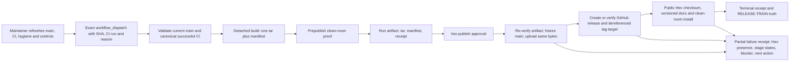

# Phase 143: Publish and Verify Lockspire 1.5.1 - Research

**Researched:** 2026-10-07  
**Domain:** Elixir package release engineering, GitHub Actions, Hex publication and artifact provenance  
**Confidence:** HIGH for repository contracts and official documented behavior; MEDIUM for current external state, which must be refreshed immediately before dispatch.

<user_constraints>
## User Constraints (from CONTEXT.md)

### Locked Decisions

### Candidate and publication authorization
- **D-01:** Treat Phase 142's accepted SHA `6f1a19b39999f96eb24352c75c2a0628375175ae` as a dated readiness observation, not standing publication authorization. Immediately before dispatch, refresh remote `main` and re-establish the full current SHA, its matching successful canonical CI run, repository-hygiene result, public package/tag state, and the live protected controls.
- **D-02:** First establish whether the already-prepared 1.5.1 release metadata on current `main` is publishable without another Release Please merge. If a release PR must merge, use the reviewed path, then repeat exact-SHA CI, hygiene, and authorization checks against the new merge SHA. Never silently substitute a newer or older commit during the dispatch.
- **D-03:** Keep Release Please auto-merge closed during this exceptional release. Authorize only one lowercase 40-character current-main SHA, dispatch the protected workflow with its matching CI run ID and a concise reason, and retain the existing `hex-publish` environment approval as the final human gate before Hex credentials are available. Clear the one-SHA authorization after the attempt. If `main` changes or the run becomes stale, stop and reauthorize with fresh evidence.
- **D-04:** Do not use a tag-triggered or unattended publish as the release authority. A tag can identify an old/non-current commit, and an automatic Release Please merge would change the candidate and its required evidence. Keep the ordinary sustaining auto-merge lane closed until the 1.5.1 result and repository controls are reconciled.

### Artifact identity and public proof
- **D-05:** Build one package tar from the detached, verified SHA. Bind source SHA, version, filename, byte length, and SHA-256 in the manifest; run prepublish proof against those tar bytes; transfer the tar and manifest as one immutable run artifact; and have the protected publisher re-verify and publish those same bytes. Do not rebuild in the credentialed job. Use the SHA-256 of the whole outer Hex tarball when comparing the registry checksum.
- **D-06:** A complete release requires all of these to agree: the manifest and source SHA, the public Hex release checksum and exact-version docs, the `lockspire-v1.5.1` GitHub release and actual tag target, and the clean-room journey installed from the public Hex package. For an existing GitHub tag, verify the remote tag ref and peel annotated tags to the commit; `targetCommitish` alone does not prove the target when a tag already exists. Stop on a mismatch; never retarget an existing tag to make the evidence appear to match.
- **D-07:** Keep the publisher compatible with the exact-tar model. The current workflow installs the latest Hex client in the publish job and calls `Hex.API.Release.publish/5`, while the manifest records the builder's Hex version. Planning should establish and record a compatible publisher-client version or supported direct-tar upload surface without changing the package tar bytes. A publisher/API compatibility failure blocks the release; it does not justify rebuilding under the old proof.

### Failure truth and recovery
- **D-08:** Preserve a bounded, redacted terminal receipt for every outcome, including failures after Hex accepts the package but before GitHub release creation or public install verification. The receipt should identify the source SHA, CI run, package version and manifest digest, and each stage as passed, failed, not run, or unknown; include observed Hex checksum/public presence, GitHub release and dereferenced tag state, install-proof state, and the blocker/next safe action. The current postpublish job runs only after the publish job succeeds, so a plan must cover partial-publication paths as well as the all-success path.
- **D-09:** Separate public presence from verified completion. If Hex has accepted 1.5.1 but a later gate fails, record that Hex now exposes 1.5.1 while stating that release proof is incomplete; do not say the verified release shipped, close the milestone, or leave 1.5.0 recorded as the latest public package when that is no longer true.
- **D-10:** Recovery may resume only with the same authorized source SHA and the same manifest-verified tar. Re-query Hex and accept an existing 1.5.1 only when its whole-tar checksum matches; otherwise stop. Do not automatically revert, overwrite, or rebuild a package under previous evidence. Keep the exact package artifact available through the practical recovery window; current tar retention is 30 days while final evidence is 90 days, so make the expiry boundary explicit and never claim same-artifact recovery after its bytes are unavailable.
- **D-11:** Keep the final maintainer-facing result consumer- and decision-focused: current public version, whether release proof is complete, source SHA, matching CI run, package checksum, GitHub release/tag target, install result, blockers, and next safe action. Link bounded receipts rather than copying raw logs; redact credentials and copy-once values.

### the agent's Discretion
- Reuse the existing exact-ref workflow, artifact manifest, idempotent Hex publisher, main-freeze helper, clean-room journey, and release contract tests. Keep new checks narrow to the Phase 143 success criteria.
- Use the existing environment-scoped Hex credential for this cut. Hex Trusted Publishers/OIDC and signed build attestations are possible later hardening, but are not prerequisites for this release and should not delay or widen it.
- No UI, API, or visual-design decision applies. The brand book is not a release-workflow reference.

### Deferred Ideas (OUT OF SCOPE)
- Hex Trusted Publishers/OIDC and signed build attestations may be evaluated as separate supply-chain hardening after the 1.5.1 cut; they are not necessary to satisfy the already-defined exact-SHA and manifest/checksum contract.
- Broad release-system redesign, new runtime/public API or OAuth/OIDC behavior, admin UI, visual design, and supplemental conformance gates are outside Phase 143.
</user_constraints>

<phase_requirements>
## Phase Requirements

| ID | Description | Research Support |
|----|-------------|------------------|
| REL-01 | Maintainer can publish Lockspire 1.5.1 only through the protected release workflow for the exact current `main` SHA with its matching successful canonical CI run. | Existing workflow already validates exact SHA and CI identity; require fresh readiness/hygiene/live-control evidence, one-SHA authorization, and approved `hex-publish` environment before dispatch/publish. |
| REL-02 | Maintainer can verify that the public Hex package checksum matches the workflow's manifest-bound artifact, the `lockspire-v1.5.1` GitHub release targets the same source, and the clean-room public install journey passes. | Preserve build-once artifact and verify outer-tar SHA; resolve actual tag ref to commit; verify versioned docs and execute clean-room journey from public Hex. |
| REL-03 | If a release gate fails, maintainer can preserve its evidence and record the blocker without claiming 1.5.1 shipped or closing the milestone. | Extend the bounded receipt to all terminal paths and represent per-stage state plus Hex presence separately from verified completion; record accurate release-train truth and same-artifact recovery limits. |
</phase_requirements>

## Summary

Phase 143 is an operational release transaction, not a new Elixir/Phoenix feature. Keep the current protected exact-SHA dispatch as the authority: refresh current `main`, canonical CI and repository hygiene; confirm the 1.5.1 release metadata and live controls; authorize exactly one candidate; then let the workflow's protected `hex-publish` environment gate the credential-bearing publish job. GitHub documents that environment protection can require manual approval and that environment secrets are exposed only to jobs that reference the environment after approval. [CITED: https://docs.github.com/en/actions/reference/workflows-and-actions/deployments-and-environments]

The workflow already builds and tests one package tar, binds its source/version/filename/size/SHA-256 in a manifest, transfers it as an artifact, re-verifies it in the protected publisher, and performs public checksum/docs/install verification. [VERIFIED: .github/workflows/release.yml:174-208, 244-262; scripts/publish/release_artifact.py:104-120, 165-175] The plan should focus on two bounded gaps already identified in CONTEXT: validate the actual remote Git tag target rather than `targetCommitish`, and preserve an outcome receipt for failure paths after package publication. Avoid broad redesign, a new publish service, or OIDC/attestation work.

**Primary recommendation:** Plan a short, gated release path with (1) fresh exact-main readiness and metadata decision, (2) narrow proof/receipt fixes and contract coverage, (3) one protected dispatch and human environment approval, and (4) factual public-truth closeout. If any gate fails, stop, save bounded evidence, report public Hex presence accurately, and leave the milestone incomplete. Do not publish or change remote controls outside that authorized workflow.

## Architectural Responsibility Map

| Capability | Primary Tier | Secondary Tier | Rationale |
|------------|-------------|----------------|-----------|
| Candidate identity, CI join, and dispatch input validation | GitHub Actions / repository automation | Maintainer operations | The workflow validates the SHA, current `main`, canonical workflow identity, successful run, and matching head SHA before building. [VERIFIED: .github/workflows/release.yml:70-123] |
| Artifact creation and manifest binding | Build job / artifact storage | Protected publisher | The unprivileged prepublish job builds the tar once and the Actions artifact transfers those tested bytes to the protected job. [VERIFIED: .github/workflows/release.yml:125-208; CITED: https://docs.github.com/en/actions/concepts/workflows-and-actions/workflow-artifacts] |
| Hex upload and temporary main freeze | Protected GitHub Actions environment | Hex API, GitHub rulesets | Credentials are environment scoped; the publisher serializes main and checks the live source and authorization before upload. [VERIFIED: .github/workflows/release.yml:210-300; scripts/publish/release_main_freeze.sh:94-133, 153-172] |
| GitHub release/tag source verification | Git refs / release metadata | Protected publish job | The tag object must be dereferenced to its commit; release metadata's `target_commitish` is unused if the tag already exists. [CITED: https://docs.github.com/en/rest/releases/releases] |
| Public package truth and consumer install | Hex registry/CDN and clean-room test | Release evidence/ledger | The public package checksum, docs, and install must be observed independently after upload, then projected accurately into the release train. [VERIFIED: scripts/publish/verify_install_truth.sh:25-75; .planning/ROADMAP.md:50-55] |
| Failure receipt and recovery decision | Release evidence artifacts and maintainer ledger | Maintainer | Per-stage evidence makes partial publication visible; recovery must reuse the same source SHA and verified tar. [VERIFIED: scripts/publish/release_artifact.py:222-252; CONTEXT.md D-08–D-10] |

## Project Constraints (from AGENTS.md)

- Keep Lockspire a separate companion library; preserve its embedded Phoenix/Elixir library shape and do not convert it into a required standalone auth service.
- Preserve boundaries between protocol core, storage, generators, Plug/Phoenix integration, and LiveView/admin surfaces.
- Keep the host seam narrow: account resolution, claims, login redirects, branding, and product policy belong to the host application.
- Do not widen v1 into SAML, LDAP/AD federation, hosted auth, or full CIAM.
- Preserve the documented Phoenix `1.8.5`, Phoenix LiveView `1.1.28`, Ecto SQL `3.13.5`, PostgreSQL `14+`, Bandit `1.6.1`, Oban `2.21.x`, and OpenTelemetry `1.6.0` product stack if relevant. [VERIFIED: AGENTS.md:26-33; verbatim: `Phoenix 1.8.5`, `Phoenix LiveView 1.1.28`, `Ecto SQL 3.13.5`, `PostgreSQL 14+`, `Bandit 1.6.1`, `Oban 2.21.x`, `OpenTelemetry 1.6.0`]
- Maintain product priorities: install DX; secure authorization-code + PKCE defaults; OIDC metadata/lifecycle; calm operator workflows; telemetry/auditability/release hygiene/executable docs.
- Preserve security defaults: PKCE S256, exact-match redirect URIs, hashed client secrets, short-lived single-use authorization codes, refresh rotation and family revocation on reuse, no implicit flow, no `alg=none`, and strong redaction. This phase touches release evidence/credentials only; it must not change OAuth/OIDC behavior.
- Planning directives are in `.planning/PROJECT.md`, `.planning/REQUIREMENTS.md`, `.planning/ROADMAP.md`, `.planning/STATE.md`, and `.planning/research/SUMMARY.md`.

## Standard Stack

### Core

| Component | Version / contract | Purpose | Recommendation |
|-----------|-------------------|---------|----------------|
| GitHub Actions | Existing `.github/workflows/release.yml` | Exact-SHA validation, prepublish proof, protected publish, public install truth | Reuse the existing workflow. It already has `push` and `workflow_dispatch` triggers; dispatch requires a nonempty reason, a lowercase 40-hex full commit, and a CI run ID. [VERIFIED: .github/workflows/release.yml:3-19, 70-123; verbatim: `workflow_dispatch:`, `recovery_reason:`, `recovery_ref:`, `source_ci_run_id:`; `[[ "$RECOVERY_REF" =~ ^[0-9a-f]{40}$ ]]`] |
| GitHub `hex-publish` environment | Existing protected environment | Human release approval and scoped secrets | Keep approval as the final human gate; verify live reviewer and deployment-branch restrictions at execution time. Environment secrets are unavailable until required approval. [CITED: https://docs.github.com/en/actions/reference/workflows-and-actions/deployments-and-environments] |
| Elixir/Mix package toolchain | Release workflow pins Elixir `1.19.5` and OTP `28` | Build, package preflight and docs | Use the workflow's recorded toolchain for the release artifact. A local environment is not release authority. [VERIFIED: .github/workflows/release.yml:25-30; verbatim: `ELIXIR_VERSION: "1.19.5"`, `OTP_VERSION: "28"`] |
| Hex / `hex_core` | Use the exact archive version captured as builder `runtime.hex`; record the same exact value as `runtime.publisher_hex` | Publish package and docs; calculate/compare checksums | Expand manifest/runtime validation allowlist and fixtures; before authorization, verify API export and exact-byte fixture, failing closed on mismatch. Use the **outer** tar checksum. Hex's direct `Hex.API.Release` surface is undocumented/version-bound. [VERIFIED: `scripts/publish/release_artifact.py:65-84, 156-163`; `scripts/publish/upload_hex_artifact.exs:1-18`; CITED: https://raw.githubusercontent.com/hexpm/hex/main/lib/hex/api/release.ex; https://hex-core.hexdocs.pm/hex_tarball.html] |
| GitHub Actions artifact | Existing upload/download actions pinned by SHA | Handoff of tar, manifest, and prepublish receipt | Preserve the same immutable run artifact across job boundary; do not rebuild in the protected job. [VERIFIED: .github/workflows/release.yml:199-208, 244-262; CITED: https://docs.github.com/en/actions/concepts/workflows-and-actions/workflow-artifacts] |
| Python 3 + shell/`jq` | Existing workflow runner tools | Manifest checks, REST/API inspection, receipts | Extend the repository-owned release scripts and tests; do not add an external dependency for this phase. [VERIFIED: scripts/publish/release_artifact.py:6-20; .github/workflows/release.yml:95-123] |

### Supporting

| Component | Purpose | Use |
|-----------|---------|-----|
| `scripts/publish/release_artifact.py` | Create/verify manifest and current receipts | Extend only if needed for stage-state/terminal-receipt contract; keep strict allowlists and credential redaction. [VERIFIED: scripts/publish/release_artifact.py:104-120, 134-163, 222-252] |
| `scripts/publish/release_main_freeze.sh` | Temporary no-bypass main update freeze and immediate prepublish equality check | Preserve live hosted-main/auth/current-fetch checks and always-run cleanup. [VERIFIED: scripts/publish/release_main_freeze.sh:59-91, 94-149] |
| `scripts/publish/publish_hex_idempotently.sh` + `upload_hex_artifact.exs` | Match an existing Hex release by checksum or upload exact tar bytes | Keep idempotent behavior; never call package-building publish in the credentialed job. [VERIFIED: scripts/publish/publish_hex_idempotently.sh:27-55; scripts/publish/upload_hex_artifact.exs:4-18] |
| `scripts/publish/verify_install_truth.sh` + `scripts/acceptance/run_clean_room_saas_journey.sh` | Public checksum/docs and public package install journey | Reuse for postpublish consumer proof; preserve its bounded retries and immediate checksum mismatch failure. [VERIFIED: scripts/publish/verify_install_truth.sh:25-75] |
| ExUnit contract tests | Regression protection for workflow/artifact/freeze/verification contracts | Extend the smallest existing tests for tag target, partial outcomes, and receipt schema. Test names/files are read from `test/lockspire/`. |

### Alternatives Considered

| Instead of | Could Use | Tradeoff |
|------------|-----------|----------|
| Existing manifest-bound tar upload | Ordinary `mix hex.publish --yes` | Hex documents this as normal automation and it is simpler, but it builds/publishes from the checked-out source rather than proving publication of the already-tested tar. Keep this as an ecosystem comparator, not this release implementation. [CITED: https://hex.pm/docs/publish; https://hex.hexdocs.pm/Mix.Tasks.Hex.Publish.html] |
| Exact-SHA `workflow_dispatch` plus environment approval | Tag-triggered or unattended release | Easier routine flow but not the selected authority for this exceptional cut. It can lose the exact current-main candidate guarantee. Keep deferred by D-03/D-04. |
| Existing environment-scoped Hex API key | Hex Trusted Publishers/OIDC | OIDC can remove a stored API key, but adds independent setup and is explicitly deferred for this release. Do not change GitHub settings or credential model in the plan. |
| Same-run artifact handoff | Build again in protected job | Rebuild is operationally simple but can produce bytes different from the prepublish-tested package; prohibited by D-05. |

**Package legitimacy:** No new external package is required or recommended for Phase 143, so the package legitimacy gate and registry install audit do not apply.

## Architecture Patterns

### Data flow



The arrows represent the current architecture and recommended bounded additions. Workflow artifacts are intended to persist job output and hand it to another job. [CITED: https://docs.github.com/en/actions/concepts/workflows-and-actions/workflow-artifacts]

### Recommended Project Structure

No new subsystem. Keep changes within the current ownership boundaries:

```text
.github/workflows/release.yml                    # orchestration and protected job boundaries
scripts/publish/release_artifact.py               # allowlisted manifest and terminal receipt
scripts/publish/release_main_freeze.sh            # current-main freeze and authorization checks
scripts/publish/publish_hex_idempotently.sh       # idempotent exact-tar publication
scripts/publish/verify_install_truth.sh           # Hex/docs/install public truth
test/lockspire/*release* / *publish*               # focused contracts
.planning/RELEASE-TRAIN.md                        # actual public package truth or explicit blocker
```

### Pattern 1: Refresh then dispatch exact candidate

**What:** Treat Phase 142's source SHA as historical evidence. Immediately before any dispatch, fetch `main`, confirm remote/hosted refs agree, join the successful canonical CI run to that exact SHA, repeat the hygiene gate, inspect live protection and public release state, and confirm that current main contains the prepared version metadata. If release bookkeeping must merge, restart candidate proof for the new commit. [VERIFIED: CONTEXT.md D-01–D-04; docs/maintainer-release.md:84, 98-110]

**When to use:** Every Phase 143 publish attempt and any authorized recovery attempt.

**Important GitHub behavior:** `workflow_dispatch` requires the workflow on the default branch and repository write access; it can run via UI, CLI, or REST. [CITED: https://docs.github.com/en/actions/how-tos/manage-workflow-runs/manually-run-a-workflow] The current workflow pins dispatch ref to `main` and validates the passed commit and CI run. Do not confuse the workflow's trigger ref (`main`) with the `recovery_ref` immutable source commit. [VERIFIED: .github/workflows/release.yml:70-123]

### Pattern 2: Manifest-bound build once, verify, publish those bytes

**What:** In the detached prepublish job, build the tar once; manifest-bind the package version, source SHA, filename, byte length and SHA-256; execute prepublish journey with that tar; transfer tar + manifest + receipt through the run artifact; verify file count, no symlinks, manifest identity and checksum in the environment-protected publisher; then upload the tar bytes without a rebuild. [VERIFIED: .github/workflows/release.yml:153-208, 244-262; scripts/publish/release_artifact.py:104-120, 165-175]

**Checksum rule:** Hex's package tarball exposes `outer_checksum` and `inner_checksum`; documentation says the inner checksum is deprecated and says to compare the outer tarball checksum with the registry checksum. The manifest's SHA-256 of the complete tar must be the matching Hex registry value. [CITED: https://hex-core.hexdocs.pm/hex_tarball.html]

**Publisher compatibility resolution (D-07):** Use the exact Hex archive version captured as `runtime.hex` by the unprivileged artifact builder as the publisher Hex version too; write that identical value to `runtime.publisher_hex` in the manifest and update strict manifest/runtime allowlists plus contract fixtures accordingly. Before the human publish-or-cancel decision and protected environment approval, the unprivileged prepublish job must install/select that exact archive and fail closed unless it exposes `Hex.API.Release.publish/5` and the exact-tar contract fixture confirms it sends the supplied bytes. `LOCKSPIRE_PHASE143_AUTHORIZED_SHA` is a necessary candidate-scoped publication guard, but insufficient by itself: human authorization and native `hex-publish` approval remain separate gates, and the variable alone exposes no credentials. If the function is missing, the manifest value differs, or the fixture fails, stop before the human decision; cancel any still-active exact run, collect its terminal receipt, and clear the guard. Never rebuild or silently substitute a client. Hex's official source defines `publish/5` but marks `Hex.API.Release` with `@moduledoc false`, so this is an undocumented, version-bound internal API rather than a promise of a stable compatibility range. Hex's official Mix guidance describes `mix hex.publish` as the normal publishing interface and warns CI may install the latest client; that convenience path is not interchangeable with Lockspire's exact-tar contract. [CITED: https://raw.githubusercontent.com/hexpm/hex/main/lib/hex/api/release.ex; https://hex.pm/docs/publish; VERIFIED: `.github/workflows/release.yml:169-173, 240-243`; `scripts/publish/upload_hex_artifact.exs:4-18`]

### Pattern 3: Dereference an existing GitHub tag

**What:** For tag absence, create the release on the verified SHA. For an existing release/tag, query the remote `refs/tags/lockspire-v1.5.1`, determine whether the tag object is annotated, peel it to the underlying commit, and compare that commit with the verified source SHA. Validate the release exists and is published as expected. Never accept `targetCommitish` as proof for an already-existing tag or retarget a mismatch. [CITED: https://docs.github.com/en/rest/releases/releases; CONTEXT.md D-06]

GitHub's create-release API explicitly says `target_commitish` is **“Unused if the Git tag already exists.”** [CITED: https://docs.github.com/en/rest/releases/releases] Existing workflow only reads `.targetCommitish` when release lookup succeeds, which leaves the precise target gap. [VERIFIED: .github/workflows/release.yml:301-317; quoted source: `gh release view "$tag_name" --json targetCommitish --jq '.targetCommitish'`]

### Pattern 4: Always preserve terminal truth

**What:** Ensure all outcomes produce bounded, redacted stage evidence, including a Hex-accepted partial failure and downstream verification failure. Track candidate SHA, CI run, version, manifest digest, Hex release/checksum presence, GitHub release and resolved tag target, install proof and a blocker/next safe action. Model each stage as passed, failed, not run, or unknown. Do not infer package absence from a failed job or call the release verified because Hex alone accepted it. [VERIFIED: CONTEXT.md D-08–D-11; scripts/publish/release_artifact.py:222-252]

**Where current flow is incomplete:** The post-publish job condition is `needs.publish.result == 'success'`, so a publish job failing after Hex accepted a package will skip that job. Existing receipt command only allows stage `prepublish` or `postpublish` and always emits status `verified`; it does not encode partial stage outcomes. [VERIFIED: .github/workflows/release.yml:354-358; scripts/publish/release_artifact.py:222-252; verbatim: `choices=("prepublish", "postpublish")`; `"status": "verified"`]

### Pattern 5: Publish truth is separate from artifact truth

**What:** Record current public package truth and phase completion independently. If public Hex now exposes 1.5.1 but GitHub tag/docs/install evidence is incomplete, `.planning/RELEASE-TRAIN.md` must show 1.5.1 public with matching known checksum or observed facts and clearly mark full verification incomplete; preserve blocker and keep milestone open. On complete success, record all roadmap-required evidence. [VERIFIED: .planning/ROADMAP.md:50-55; CONTEXT.md D-09/D-11]

## Don't Hand-Roll

| Problem | Don't Build | Use Instead | Why |
|---------|-------------|-------------|-----|
| Release candidate authorization | New tag release path or alternate deploy service | Current exact-SHA workflow dispatch, matching canonical CI, one-SHA variable, protected environment | Existing workflow owns the cross-check and protected secret boundary. |
| Package identity proof | Rebuild in publish job, trust a version label alone, or compare a tar inner checksum | Existing manifest + exact artifact handoff + `release_artifact.py verify-local` + Hex outer checksum | Proves source and exact tested bytes continue across job boundary. |
| Existing tag target | Trust GitHub `targetCommitish` | Read remote tag ref and dereference annotated tag to commit | GitHub documents target_commitish is unused when the tag exists. |
| Hex publishing | Custom HTTP client or alternate package tool | Repository's exact-tar uploader, after publisher compatibility is confirmed | Existing idempotent publisher handles matching existing release versus upload, while exact-tar API preserves supplied bytes. |
| Public install | Local path dependency or rebuilding source | Existing clean-room journey against public Hex package and expected checksum | Tests adopter-visible package contents and registry truth, not the working tree. |
| Receipt schema | Raw workflow log archive or ad-hoc freeform summary | Strict bounded JSON receipt with explicit stage state and redaction | Makes partial outcomes auditable without publishing credentials or noisy/raw user journey data. |
| Routine library release convention | Replace this exact-byte contract with `mix hex.publish --yes` | Use Hex's standard command only as comparator; preserve current approved contract | Hex's standard command is idiomatic but does not meet this phase's exact-tar proof without extra evidence. |

**Key insight:** Elixir/Hex's common release ergonomics optimize for a maintainer publishing the checked-out Mix project; this release's harder requirement is proving that public Hex serves the same bytes that passed prepublish proof. Keep the exact-artifact path because it directly serves that consumer assurance.

## Common Pitfalls

### Pitfall 1: Treating dated readiness as authorization
**What goes wrong:** A previously green commit is dispatched after `main`, CI, release metadata, settings, or public state changes.  
**How to avoid:** Re-fetch and independently join current `main`, exact successful canonical CI, hygiene disposition, live environment controls, and public package/tag state immediately before dispatch. If the candidate changes, repeat all joins. [VERIFIED: CONTEXT.md D-01/D-02]

### Pitfall 2: Assuming the release API target describes an existing tag
**What goes wrong:** Release API metadata points at the intended source, but the existing tag object resolves elsewhere.  
**How to avoid:** Resolve the Git ref and peel tag objects. GitHub says target_commitish is unused when tag already exists. [CITED: https://docs.github.com/en/rest/releases/releases]

### Pitfall 3: Rebuilding to fix a failed exact-tar publish
**What goes wrong:** New bytes no longer match the proof and manifest; old CI evidence incorrectly appears to cover them.  
**How to avoid:** Stop and diagnose client/registry behavior. Resume only if the same source SHA and same manifest-bound tar remain available and checksum matches. Artifact retention is 30 days in the current workflow; final evidence retention is 90 days, so recovery after the tar expires needs a new candidate and fresh proof, not a claim of same-artifact replay. [VERIFIED: .github/workflows/release.yml:199-208, 431-453; CONTEXT.md D-10]

### Pitfall 4: Missing a partial-publication outcome
**What goes wrong:** Hex accepted the package, but GitHub release, docs verification, or clean-room install fails; conditional jobs skip and no terminal receipt captures the mixed truth.  
**How to avoid:** Add an always/failure-capable bounded receipt path; explicitly query public Hex state and tag state before reporting; distinguish `public on Hex` from verified release completion. Keep postpublish proof unprivileged. [VERIFIED: .github/workflows/release.yml:354-358; CONTEXT.md D-08/D-09]

### Pitfall 5: GitHub Actions concurrency replacing pending release run
**What goes wrong:** A second pending run in a concurrency group replaces the first pending run by default.  
**How to avoid:** Dispatch once, inspect queued/waiting/in-progress runs, and do not treat a canceled/replaced run as proof. GitHub documents only one pending run per group by default unless queueing is enabled. [CITED: https://docs.github.com/en/actions/concepts/workflows-and-actions/concurrency]

### Pitfall 6: Calling normal Hex publishing from the credentialed job
**What goes wrong:** The client assembles another package or an unnoticed warning is bypassed, breaking the build-once proof.  
**How to avoid:** Use same-tar upload after client compatibility is validated; keep `HEX_API_KEY` at the protected step boundary and don't emit it in output. Hex docs warn automated publication may miss package warnings. [CITED: https://hex.pm/docs/publish; VERIFIED: scripts/publish/release_main_freeze.sh:153-172]

### Pitfall 7: Claiming overall success from a single green job
**What goes wrong:** Green CI, Hex visibility, GitHub release creation, or docs response is treated as complete package proof.  
**How to avoid:** Require all four independent facts to agree: source+manifest, Hex checksum+docs, resolved GitHub tag+release, and clean-room public install. Update release train and milestone only from those facts. [VERIFIED: .planning/ROADMAP.md:50-55; CONTEXT.md D-06/D-09]

## Code Examples

### Exact artifact validation sequence

The repository already implements the core call pattern. Its current validation contract quotes:

```text
"release_artifact.py verify-local"
"--source-sha \"$VERIFIED_SHA\""
"test \"$(git rev-parse HEAD)\" = \"$VERIFIED_SHA\""
```

These are source excerpts from `.github/workflows/release.yml:157-164, 259-262`. Keep this validation before protected upload; add the actual tag-ref dereference and terminal-receipt path alongside these existing contracts.

### GitHub protected environment and exact dispatch

The protected environment must remain the gate that makes its environment secret available: GitHub documents secrets only become available to environment jobs after any required approval. [CITED: https://docs.github.com/en/actions/reference/workflows-and-actions/deployments-and-environments]

Hex's standard command uses `HEX_API_KEY` with `mix hex.publish --yes`, and documentation is built/published by the task. [CITED: https://hex.pm/docs/publish] For Lockspire, keep the secret scoped to the existing publish step and use the repository's exact-tar upload path, because the approved contract requires manifest-bound bytes.

### Tag resolution example (conceptual)

```text
read refs/tags/lockspire-v1.5.1
if ref object is an annotated tag:
  read tag object and follow its target
compare peeled commit SHA with verified source SHA
```

The tag string and required resolution rule are quoted from CONTEXT.md D-06; the remote ref and commit must be freshly observed during execution. The GitHub REST release field cannot replace this check because `target_commitish` is unused if tag exists. [CITED: https://docs.github.com/en/rest/releases/releases]

## State of the Art

| Old / simpler approach | Current selected approach | Impact |
|------------------------|--------------------------|--------|
| Standard `mix hex.publish --yes` from checkout | Prebuild exact tar, bind manifest, upload those bytes after protected approval | A little more pipeline complexity gives stronger evidence that tested bytes are the published package. [CITED: https://hex.pm/docs/publish; repository contract: `.github/workflows/release.yml`] |
| Release by tag or automatic release merge | Exact-current-main dispatch plus explicit one-SHA authorization for this exceptional cut | Avoids treating stale tag identity or an auto-merged new SHA as the approved artifact. This is project-specific policy in CONTEXT.md, not a universal Elixir convention. |
| Record only success | Durable terminal stage receipt and separate public-presence/verified-completion status | Makes partial Hex publication recoverable and keeps release ledger accurate. |
| Opaque package checksum | Hex outer tar checksum | Hex's `hex_core` docs deprecate inner checksum and direct consumers to compare outer checksum to registry checksum. [CITED: https://hex-core.hexdocs.pm/hex_tarball.html] |

### Elixir / Phoenix / brandbook relevance

Elixir and Hex conventions matter for package build, docs generation, release metadata, and test commands. The project's OSS prompt recommends normal `mix hex.publish --yes`, package metadata, versioned docs, and `mix hex.publish --dry-run`; the runbook also documents the boundary between ordinary `mix ci` contributor checks and maintainer-only `mix release.preflight`. [CITED: `prompts/lockspire-elixir-oss-library-practices.md` sections “Package like a serious Hex dependency” and “Hex publishing best practices”; VERIFIED: `mix.exs:91-155`, `docs/maintainer-release.md:78-85`]

Phoenix/Plug/Ecto product architecture and OAuth implementation practices are not phase concerns: this phase does not alter runtime library modules, database schema, public API, host seam, or admin UI. Ecosystem examples from Phoenix/Plug/Ecto are useful for normal CI discipline but do not establish exact-byte publication. The brandbook concerns product-facing visual identity, while this phase has no UI or visual output; CONTEXT explicitly excludes visual-design decisions. [VERIFIED: CONTEXT.md lines 7-10, D-Discretion; `prompts/README.md` lines 3-24]

## Validation Architecture

### Test Framework

| Property | Value |
|----------|-------|
| Framework | ExUnit; release automation contract tests in `test/lockspire/` |
| Config file | `mix.exs` defines `test.fast` to run `test/lockspire`, `test/mix`, and `test/integration`; the release workflow's CI run remains the live release gate. |
| Focused command | `mix test test/lockspire/release_artifact_chain_contract_test.exs test/lockspire/publish_verification_test.exs test/lockspire/release_main_freeze_test.exs test/lockspire/release_workflow_artifact_contract_test.exs` |
| Broad local project command | `mix test.fast` (starts test setup, then release and other unit/integration contract tests in the specified directories). |
| Full canonical gate | `mix ci`; exact workflow must be checked on current candidate SHA, not merely run locally. |

The command aliases are quoted from `mix.exs:91-100, 147-155`: `"test.fast": ["test.setup", "test test/lockspire test/mix test/integration"]`, and `ci` includes `"cmd sh -lc 'MIX_ENV=test mix test.fast'"` plus integration and package/docs/QA steps. Use focused contract tests for workflow/script changes; do not add OAuth product tests for a release-only change. No tests were run as part of this research.

### Phase Requirements → Test Map

| Req ID | Behavior | Test Type | Automated Command | Existing coverage / gap |
|--------|----------|-----------|--------------------|-------------------------|
| REL-01 | Exact current `main` and same-SHA canonical CI required before protected publish | Contract + live workflow evidence | `mix test test/lockspire/release_ci_evidence_contract_test.exs test/lockspire/release_main_freeze_test.exs test/lockspire/release_workflow_artifact_contract_test.exs` | Existing contracts cover source validation and freeze; execution must refresh GitHub CI, hygiene, and environment control evidence. |
| REL-02 | Hex outer checksum, correct GitHub tag target, docs and public clean-room install | Contract + protected workflow smoke | `mix test test/lockspire/release_artifact_chain_contract_test.exs test/lockspire/publish_verification_test.exs test/lockspire/release_workflow_artifact_contract_test.exs` | Existing tests cover checksum and installer; add coverage for actual existing tag-ref peel and mismatch stop. Live public checksum/docs/install proof is required. |
| REL-03 | All outcomes preserve receipts/blockers and do not claim ship on partial publication | Contract + live public-state inspection | `mix test test/lockspire/release_artifact_chain_contract_test.exs test/lockspire/publish_verification_test.exs test/lockspire/release_workflow_artifact_contract_test.exs` | Existing basic stage receipt is success-only; add failure/partial outcome fixtures and verify release-train truth rules. |

### Wave 0 Gaps

- No new framework/setup gap is apparent. Focused tests already exist for artifact chain, publication verification, CI evidence, main freeze, and workflow artifact contracts; extend relevant existing suites instead of adding a new harness. [VERIFIED: `rg --files test/lockspire` inventory; `mix.exs:91-100`]
- No live GitHub/Hex facts are checked by unit tests; the plan needs explicit read-only pre-dispatch evidence capture and postpublish public observations.
- The artifact must be recoverable only within its actual retention period. Runbook says final evidence retention is explicit and workflow artifact retention is 30 days for package input; confirm against current workflow at execution. [VERIFIED: `.github/workflows/release.yml:199-208`; `docs/maintainer-release.md:198-201`]

## Security Domain

Security enforcement applies because this phase publishes software and handles a Hex credential. It does not modify OAuth security controls.

### Applicable ASVS Categories (adapted to release lane)

| ASVS Category | Applies | Control for this phase |
|---------------|---------|------------------------|
| V2 Authentication | Yes, operational identity | Only an authorized maintainer can dispatch and approve the protected environment; do not treat self-review as independent review. [CITED: GitHub environment docs; VERIFIED: `docs/maintainer-release.md:118-121`] |
| V3 Session Management | Partial | Keep temporary GitHub App token narrowly scoped to the publish job and clean up the main freeze with an always-run step. [VERIFIED: `.github/workflows/release.yml:263-279, 345-353`] |
| V4 Access Control | Yes | Keep job permissions minimal; Hex API key is environment-scoped and supplied only in credentialed publisher step. [VERIFIED: `docs/maintainer-release.md:113-125`; `scripts/publish/release_main_freeze.sh:153-172`] |
| V5 Input Validation | Yes | Validate exact lowercase full SHA and numeric run ID; allowlist manifest fields, file name and runtime values; reject symlinks or mismatches before publish. [VERIFIED: `.github/workflows/release.yml:95-123, 249-262`; `scripts/publish/release_artifact.py:134-163`] |
| V6 Cryptography | Yes | Use SHA-256 of complete outer tar; never log secrets; compare public checksum exactly. [CITED: https://hex-core.hexdocs.pm/hex_tarball.html; VERIFIED: `scripts/publish/release_artifact.py:27-33, 177-196`] |
| V14 Configuration | Yes | Verify protected environment, branch restriction, approval posture, auto-merge hold, one-SHA authorization and active runs immediately before dispatch. Live controls are external state, not established by repository text. [VERIFIED: `docs/maintainer-release.md:127-135`; `[ASSUMED]` current live settings need fresh authenticated observation] |

### Known Threat Patterns

| Pattern | STRIDE | Mitigation |
|---------|--------|------------|
| Stale or substituted source commit | Tampering / elevation of privilege | Match local/fetched/hosted main, authorization SHA, recovery ref, verified SHA and canonical CI head SHA; repeat immediately before upload. |
| Artifact substitution between jobs | Tampering | Bind manifest and validate exact artifact name, size and full checksum before and during publish; no rebuild. |
| Unauthorized secret exposure | Information disclosure | Environment approval gates `HEX_API_KEY`; do not add it to outputs, manifests, receipts or raw log artifacts. GitHub environment secrets are gated by approval. [CITED: https://docs.github.com/en/actions/reference/workflows-and-actions/deployments-and-environments] |
| Stale/misdirected Git tag | Spoofing / tampering | Resolve actual tag object and compare peeled commit to verified SHA. |
| False-success evidence after partial publish | Repudiation / information disclosure | Terminal receipt records each stage and observed Hex public presence independently; blocker keeps milestone open. |

## Environment Availability

Local probes were performed for planning aid only; host capabilities do not prove repository credentials, current remote state, or release authorization.

| Dependency | Required By | Available | Observed Version / State | Fallback |
|------------|-------------|-----------|--------------------------|----------|
| Git | source ref checks | Yes | `git version 2.41.0` | None |
| GitHub CLI | optional read-only live state and dispatch tooling | Yes | `gh version 2.101.0` | GitHub REST/UI |
| Elixir/Mix | release contract tests and package tooling | Yes | Elixir `1.20.4-otp-29`; release workflow pins `1.19.5`/OTP `28` | Execute release build in workflow-pinned runtime |
| Python | manifest scripts | Yes | `3.14.4` | Workflow runner's Python |
| jq | workflow/scripts | Yes | `jq-1.7.1` | None in workflow path |
| curl | public Hex/docs checks | Yes | `8.7.1` | None in script |
| PostgreSQL | clean-room release journey | Yes | `pg_isready`: `/tmp:5432 - accepting connections` | Workflow provisions PostgreSQL service |
| Docker | local container workflows | Yes | `29.5.2` | GitHub Actions service container |
| GitHub/Hex authentication and live protected settings | actual dispatch and publish | Not probed | Unknown | Must be read-only inspected by authorized maintainer; phase does not authorize changing controls here |

**Missing dependencies with no fallback:** None identified locally. Live repository write permission and environment approval are required to dispatch/publish, but their availability is an execution-time external control to verify, not a local CLI dependency.

## Planning Resolutions and Runtime Gates

All planning questions are resolved; their associated mutable observations remain mandatory execution-time gates:

1. **Release metadata — RESOLVED FOR PLANNING.** Inspect exact current-main `mix.exs`, `.release-please-manifest.json`, `CHANGELOG.md`, and release-train truth before authorizing a candidate. If 1.5.1 metadata is not coherently prepared on current main, use only the reviewed Release Please path; after merge, repeat exact-SHA canonical CI, hygiene, and authorization checks against the new main SHA. Never treat the old Phase 142 SHA as permission. The metadata inspection result itself is a runtime fact, not fixed by this plan. [VERIFIED: CONTEXT.md D-01/D-02; `docs/maintainer-release.md:98-110`]
2. **Publisher compatibility — RESOLVED FOR PLANNING.** The publisher uses the artifact builder's exact `runtime.hex` archive and the manifest must additionally record the identical value as `runtime.publisher_hex`. Before the human publication decision and protected environment approval, the unprivileged prepublish receipt must prove that the selected archive exports `Hex.API.Release.publish/5` and passes the exact-byte fixture; fail closed on any mismatch. `LOCKSPIRE_PHASE143_AUTHORIZED_SHA` is a required, candidate-scoped guard but is insufficient alone; human approval and native environment approval remain separate. The API exists in Hex's current source but is explicitly undocumented (`@moduledoc false`), so pin/record the actual archive version used; do not claim a supported version range. [CITED: https://raw.githubusercontent.com/hexpm/hex/main/lib/hex/api/release.ex; https://hex.pm/docs/publish]
3. **Terminal receipt — RESOLVED FOR PLANNING.** Add an always-capable, read-only collector that inspects each stage and public state, writes a bounded/redacted run-scoped terminal receipt, and uploads it as a run artifact regardless of publish/postpublish job success. If GitHub cannot provide an artifact or an upstream stage's state cannot be observed, record that stage/artifact state as `unknown`, include the blocker and safe next action, and never infer absence or success. Keep the Hex credential unavailable to this collector. [VERIFIED: CONTEXT.md D-08/D-11; `.github/workflows/release.yml:354-358`]
4. **Live controls and public state — RESOLVED FOR PLANNING.** Immediately before dispatch, read and record the environment reviewer/branch/bypass policy, authorization variable, Release Please auto-merge state, queued/waiting/in-progress release runs, current main and its canonical CI/hygiene evidence, Hex package/version/checksum, and GitHub release/tag ref. These are mandatory mutable reads, never dated planning facts; stop and refresh authorization if any value is absent, stale, or mismatched. Re-query public package/tag truth after any publish attempt. [VERIFIED: CONTEXT.md D-01/D-03/D-04; `docs/maintainer-release.md:127-135`]

## Assumptions Log

| # | Planning item | Status | Execution-time gate / risk if wrong |
|---|---------------|--------|-------------------------------------|
| A1 | Current `hex-publish` environment settings match the documented approval and branch restrictions. | RESOLVED FOR PLANNING | Read the live reviewer, branch restriction and bypass posture before dispatch; stop on drift because secrets or publication may cross the intended gate. |
| A2 | Builder and publisher can use a single exact Hex archive version for the direct upload API. | RESOLVED FOR PLANNING | Copy builder `runtime.hex` to publisher selection and `runtime.publisher_hex`; before the human publication decision, the unprivileged receipt must prove API export and exact-byte fixture success. The one-SHA guard is required but insufficient without the separate human and environment approvals. `Hex.API.Release` is undocumented/version-bound; a mismatch blocks the release. |
| A3 | Current public Hex and GitHub 1.5.1 presence/checksum/tag state matches the dated observation. | RESOLVED FOR PLANNING | Do not rely on the dated observation; query live state before dispatch and again after any attempt. |
| A4 | Package tar and final evidence retention settings remain 30 days and 90 days, respectively. | RESOLVED FOR PLANNING | Verify actual retention settings and artifact availability before relying on recovery; after tar expiry, same-artifact recovery cannot be claimed. |

No unresolved research question blocks planning. All four items are resolved as plan choices with the runtime checks above; none authorizes dispatch or a GitHub settings change.

## Sources

### Primary (HIGH confidence for repository-defined contracts)

- `.planning/phases/143-publish-and-verify-lockspire-1-5-1/143-CONTEXT.md` — locked decisions D-01 through D-11, discretion and deferred boundaries; dated live-state observation.
- `.planning/phases/143-publish-and-verify-lockspire-1-5-1/143-DISCUSSION-LOG.md` — two research lanes, tradeoffs, risk refinements and source index.
- `.planning/REQUIREMENTS.md` and `.planning/ROADMAP.md` — REL-01/02/03 and phase success criteria.
- `.planning/STATE.md` — current phase and prior Phase 142 dated readiness; used as planning context only, not current authorization.
- `AGENTS.md` — library boundaries, technology stack, product priorities and OAuth/OIDC security defaults.
- `.github/workflows/release.yml`, `scripts/publish/release_artifact.py`, `scripts/publish/release_main_freeze.sh`, `scripts/publish/publish_hex_idempotently.sh`, `scripts/publish/upload_hex_artifact.exs`, `scripts/publish/verify_install_truth.sh` — checked-in release mechanics.
- `docs/maintainer-release.md` — operator process, environment credential boundary, release holds, recovery and evidence expectations.
- `mix.exs` — exact project version, runtime dependencies, and contributor/test/preflight aliases.
- Focused release contracts under `test/lockspire/` — coverage map used for the plan.
- `prompts/README.md`; release engineering/readiness prompts; release/package sections of `prompts/lockspire-elixir-oss-library-practices.md` — applicable reusable OSS/CI guidance. No dedicated fan-out prompt file was present in the `prompts/` corpus according to CONTEXT.md.

### Official documentation (MEDIUM confidence, cited)

- [GitHub Actions: Deployments and environments](https://docs.github.com/en/actions/reference/workflows-and-actions/deployments-and-environments) — required reviewers, environment secrets and branch rules.
- [GitHub Actions: Manually running a workflow](https://docs.github.com/en/actions/how-tos/manage-workflow-runs/manually-run-a-workflow) — `workflow_dispatch` requirements and CLI/API paths.
- [GitHub Actions: Workflow artifacts](https://docs.github.com/en/actions/concepts/workflows-and-actions/workflow-artifacts) — job handoff and retention behavior.
- [GitHub Actions: Concurrency](https://docs.github.com/en/actions/concepts/workflows-and-actions/concurrency) — pending run replacement and queuing.
- [GitHub REST: Releases](https://docs.github.com/en/rest/releases/releases) — existing-tag behavior of `target_commitish`.
- [Hex publishing guide](https://hex.pm/docs/publish) and [Mix.Tasks.Hex.Publish](https://hex.hexdocs.pm/Mix.Tasks.Hex.Publish.html) — idiomatic publishing, docs, API key, and warnings.
- [Mix.Tasks.Local.Hex](https://mix.hexdocs.pm/Mix.Tasks.Local.Hex.html) — official exact-version installation syntax and noninteractive `--force` option for automation.
- [Hex `Hex.API.Release` source](https://raw.githubusercontent.com/hexpm/hex/main/lib/hex/api/release.ex) — current `publish/5` implementation and `@moduledoc false`, establishing that the direct API is undocumented/version-bound.
- [hex_core `hex_tarball`](https://hex-core.hexdocs.pm/hex_tarball.html) — outer vs inner checksum and registry comparison.

### Ecosystem comparators consulted in discussion phase

- Phoenix CI, Plug CI, and Ecto SQL CI for conventional Elixir CI patterns; these do not establish exact-byte package publishing.
- Oban Hex release alias for the simpler conventional `mix hex.publish --yes` developer experience; not selected because the approved artifact contract is stricter.
- Release Please design notes for separation of release bookkeeping from package publication.

## Metadata

**Confidence breakdown:**
- Standard stack: HIGH — exact workflow and project choices read from source; the publisher uses the builder's exact `runtime.hex` and has a fail-closed API-export/byte-fixture gate before authorization.
- Architecture: HIGH — current repository code establishes artifact and secret boundaries; GitHub docs confirm external job/secret semantics.
- Pitfalls: HIGH — repository conditions expose partial-flow and existing-tag gaps; official GitHub docs confirm concurrency and tag semantics.
- Mutable public and live-control facts: LOW until refreshed immediately before dispatch.

**Research date:** 2026-10-07  
**Valid until:** 7 days for GitHub/Hex behavior and external state; repository implementation findings remain valid until source changes.
