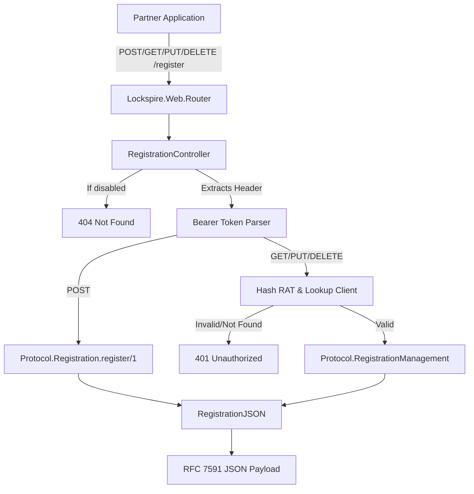

# Phase 27: HTTP Surface — Registration and Management Controllers - Research

**Researched:** 2026-04-26
**Domain:** Phoenix HTTP Controllers & JSON Views for RFC 7591/7592
**Confidence:** HIGH

## Summary

This phase exposes the RFC 7591 and RFC 7592 dynamic client registration (DCR) endpoints over HTTP. It bridges the pure `Plug.Conn`-free domain logic implemented in Phase 26 (`Lockspire.Protocol.Registration` and `RegistrationManagement`) to Phoenix's web surface.

A single unified `RegistrationController` will handle `POST`, `GET`, `PUT`, and `DELETE` at `/register`. It explicitly maps domain error codes to RFC-compliant HTTP statuses, extracts bearer tokens manually, and formats success payloads through a unified `RegistrationJSON` view. The implementation requires correctly converting internal `DateTime` fields to UNIX epochs, constructing the `registration_client_uri` via `Lockspire.Config.issuer!()`, and respecting the server policy configuration (particularly the `404` behavior when DCR is `:disabled`).

**Primary recommendation:** Implement a thin controller that defers all business logic to `Registration` and `RegistrationManagement`, and a JSON view that algorithmically flattens the `Lockspire.Domain.Client` struct and its internal `metadata` extension bag back into the flat RFC 7591 JSON shape.

<user_constraints>
## User Constraints (from CONTEXT.md)

### Locked Decisions
- **D-01:** A single `Lockspire.Web.RegistrationController` will handle all four DCR endpoints (`POST`, `GET`, `PUT`, `DELETE` at `/register`), accompanied by a unified `RegistrationJSON` view.
- **D-02:** The `Authorization: Bearer <token>` properties will be manually parsed via `Plug.Conn.get_req_header/2` in the actions. For management routes, the controller will compute the RAT hash inline and look up the client before triggering the protocol logic.
- **D-03:** The controller assumes the explicit duty of mapping domain `Registration.Error.code` atoms into valid RFC 7591/7592 HTTP statuses, attaching a `WWW-Authenticate` header and returning `401 Unauthorized` whenever hitting `:invalid_token`.
- **D-04:** The `RegistrationJSON` module will algorithmically reconstruct the flat RFC 7591 payload structure by spreading `%Lockspire.Domain.Client{}` properties and unnesting its internal `:metadata` extension bag back to strings.

### the agent's Discretion
Any assumptions where the user confirmed "you decide" or left as-is with Likely confidence.

### Deferred Ideas
None — analysis stayed within phase scope
</user_constraints>

<phase_requirements>
## Phase Requirements

| ID | Description | Research Support |
|----|-------------|------------------|
| DCR-01 | `POST /register` mounted, accepts JSON RFC 7591 metadata, gated by policy | Supported by routing structure & Protocol.Registration. |
| DCR-05 | Success response conforms to RFC 7591 §3.2.1 | Supported by custom `RegistrationJSON` view, formatting timestamps to Unix epoch and building `registration_client_uri` |
| DCR-13 | `GET /register/:client_id` RAT-auth, URL-bound, returns self-registered RFC 7591 | Supported by RAT extraction and `Lockspire.Protocol.RegistrationManagement.read/2` |
| DCR-14 | `PUT /register/:client_id` validates full replace, rotates RAT, returns new plaintext | Supported by `Lockspire.Protocol.RegistrationManagement.update/2` |
| DCR-15 | `DELETE /register/:client_id` soft-disables client via `Admin.Clients` | Supported by `Lockspire.Protocol.RegistrationManagement.delete/2` |
</phase_requirements>

## Architectural Responsibility Map

| Capability | Primary Tier | Secondary Tier | Rationale |
|------------|-------------|----------------|-----------|
| Route Dispatch | API / Backend | — | `Lockspire.Web.Router` mounts the `/register` endpoints |
| Intake Policy Enforcement | API / Backend | — | Handled by `Lockspire.Protocol.Registration.register/1` (from Phase 26) but HTTP 404 block for `:disabled` is handled here |
| Token Parsing & Validation | API / Backend | — | Controller parses `Authorization: Bearer ...` and looks up client via RAT hash |
| Output Serialization | API / Backend | — | `RegistrationJSON` maps `Domain.Client` and `Success` payloads to RFC 7591 byte-for-byte shapes |

## Standard Stack

### Core
| Library | Version | Purpose | Why Standard |
|---------|---------|---------|--------------|
| Phoenix | (existing) | Web framework | `Phoenix.Controller` and `Phoenix.View` form Lockspire's HTTP interface |
| Plug | (existing) | HTTP connections | `Plug.Conn.get_req_header/2` extracts Bearer tokens |

## Architecture Patterns

### System Architecture Diagram



### Recommended Project Structure
```
lib/lockspire/web/
├── controllers/
│   └── registration_controller.ex  # Adapts HTTP to Protocol modules
└── registration_json.ex            # RFC 7591 serialization
```

### Pattern 1: Domain-to-HTTP Error Mapping
**What:** The controller must manually map domain error codes to exact RFC 7591/7592 HTTP statuses.
**When to use:** In `RegistrationController`.
**Example:**
```elixir
defp handle_error(conn, %Registration.Error{code: :invalid_token} = error) do
  conn
  |> put_status(:unauthorized)
  |> put_resp_header("www-authenticate", ~s(Bearer realm="Lockspire Dynamic Client Registration", error="invalid_token"))
  |> json(RegistrationJSON.error_response(error))
end

defp handle_error(conn, %Registration.Error{code: :invalid_client_metadata} = error) do
  conn
  |> put_status(:bad_request)
  |> json(RegistrationJSON.error_response(error))
end
```

## Don't Hand-Roll

| Problem | Don't Build | Use Instead | Why |
|---------|-------------|-------------|-----|
| RAT Hashing | Custom hashing | `RegistrationAccessToken.hash/1` | Phase 26 defined the exact canonical hashing scheme needed to query Ecto. |
| Remote IP extraction | Complex proxy parsers | `conn.remote_ip` | Phoenix/Plug automatically corrects `conn.remote_ip` via the `RemoteIp` plug on the host app. Just convert it to string via `:inet.ntoa/1`. |

## Common Pitfalls

### Pitfall 1: Leaking Plaintext Tokens on `GET`
**What goes wrong:** Returning the `registration_access_token` and `client_secret` on `GET /register/:client_id`.
**Why it happens:** Assuming `GET` should return the exact same payload as `POST`.
**How to avoid:** Lockspire hashes RATs and secrets at rest. It is *impossible* to return the plaintext RAT or secret on `GET`. RFC 7592 §3.1 explicitly says the server "MAY include" these. The `RegistrationJSON` must only include them when they are present in the in-memory `Success` structs (which only exist immediately after generation in `POST` and `PUT`).

### Pitfall 2: 403 instead of 404 for Disabled Policy
**What goes wrong:** Returning `403 Forbidden` or `400 Bad Request` when DCR is globally disabled.
**Why it happens:** Passing the request to `Protocol.Registration` without checking the `server_policy.registration_policy`.
**How to avoid:** DCR-17 requires that when `registration_policy == :disabled`, the endpoint returns `404 Not Found`. Since Phase 26 protocol logic resolves policies but doesn't map to 404, the Controller must inspect `Lockspire.Config.server_policy().registration_policy` or map a specific protocol error to 404.

### Pitfall 3: Time Formatting
**What goes wrong:** Serializing `client_id_issued_at` as ISO8601 strings.
**Why it happens:** Standard Phoenix JSON encoding of `DateTime`.
**How to avoid:** RFC 7591 §3.2.1 explicitly demands "the number of seconds from 1970-01-01T00:00:00Z". Use `DateTime.to_unix/1`.

### Pitfall 4: Missing `registration_client_uri`
**What goes wrong:** Returning a payload without `registration_client_uri`.
**Why it happens:** The domain `Client` struct doesn't intrinsically know its own URL.
**How to avoid:** Construct it dynamically in the JSON layer or controller using `Lockspire.Config.issuer!() <> "/register/" <> client_id`.

## Code Examples

### Bearer Token Extraction & Validation Pattern
```elixir
defp extract_bearer_token(conn) do
  case Plug.Conn.get_req_header(conn, "authorization") do
    ["Bearer " <> token] -> token
    ["Bearer"] -> nil
    _ -> nil
  end
end

defp lookup_client_by_rat(conn) do
  case extract_bearer_token(conn) do
    nil -> {:error, :invalid_token}
    rat -> 
      hash = Lockspire.Protocol.RegistrationAccessToken.hash(rat)
      case Lockspire.Storage.Ecto.Repository.get_client_by_registration_access_token_hash(hash) do
        nil -> {:error, :invalid_token}
        client -> {:ok, client}
      end
  end
end
```

## State of the Art

| Old Approach | Current Approach | When Changed | Impact |
|--------------|------------------|--------------|--------|
| Custom error shapes | Strict RFC 7591 JSON responses | RFC 7591 | DCR clients break if errors lack `"error"` or `"error_description"`. |
| Exposing secrets | Copy-once credentials | Phase 26 | Controller must only serialize credentials directly from the `Success` tuples, as the domain struct only has hashes. |

## Assumptions Log

| # | Claim | Section | Risk if Wrong |
|---|-------|---------|---------------|
| A1 | Remote IP can be formatted via `:inet.ntoa(conn.remote_ip)` to string. | Pitfalls | IP audit tracking might fail if string formatting is broken. |
| A2 | `registration_client_uri` uses `Lockspire.Config.issuer!()` | Code Examples | Links returned to clients might have mismatched hostnames, violating discovery logic. |

## Open Questions (RESOLVED)

1. **How does `POST /register` behave when `registration_policy == :disabled`?**
   - What we know: DCR-17 requires returning 404 (not 403). `Protocol.Registration` doesn't enforce `404` directly (it emits domain errors).
   - Recommendation: Check `Lockspire.Config.server_policy().registration_policy` in the `RegistrationController` plugs or directly in `create/2`. If `:disabled`, short-circuit with `404 Not Found` immediately.

## Environment Availability

Step 2.6: SKIPPED (no external dependencies identified)

## Validation Architecture

### Test Framework
| Property | Value |
|----------|-------|
| Framework | ExUnit |
| Quick run command | `mix test test/lockspire/web/controllers/registration_controller_test.exs` |
| Full suite command | `mix test` |

### Phase Requirements → Test Map
| Req ID | Behavior | Test Type | Automated Command | File Exists? |
|--------|----------|-----------|-------------------|-------------|
| DCR-01 | `POST /register` is mounted and parses JSON payload | integration | `mix test test/lockspire/web/controllers/registration_controller_test.exs` | ❌ Wave 0 |
| DCR-05 | Success response conforms to RFC 7591 §3.2.1 | unit/integration | `mix test test/lockspire/web/registration_json_test.exs` | ❌ Wave 0 |
| DCR-13 | `GET /register/:client_id` authenticated via RAT | integration | `mix test test/lockspire/web/controllers/registration_controller_test.exs` | ❌ Wave 0 |
| DCR-14 | `PUT /register/:client_id` rotates RAT and replaces data | integration | `mix test test/lockspire/web/controllers/registration_controller_test.exs` | ❌ Wave 0 |
| DCR-15 | `DELETE /register/:client_id` soft-disables client | integration | `mix test test/lockspire/web/controllers/registration_controller_test.exs` | ❌ Wave 0 |

### Wave 0 Gaps
- [ ] `test/lockspire/web/controllers/registration_controller_test.exs` — covers HTTP bindings and 404 disabled behavior
- [ ] `test/lockspire/web/registration_json_test.exs` — verifies exact byte-for-byte serialization structure

## Security Domain

### Applicable ASVS Categories
| ASVS Category | Applies | Standard Control |
|---------------|---------|-----------------|
| V2 Authentication | yes | `RegistrationAccessToken.verify/2` via `Repository` hash lookup |
| V4 Access Control | yes | ServerPolicy `:disabled` mapping to 404 |
| V5 Input Validation | yes | Existing validation inside `Protocol` |

### Known Threat Patterns for Phoenix DCR
| Pattern | STRIDE | Standard Mitigation |
|---------|--------|---------------------|
| RAT enumeration | Information Disclosure | `client_id_from_url` mismatch collapses to generic `401 Unauthorized` identical to bad RAT |
| Leaking stored secrets | Information Disclosure | Omit plaintext tokens on `GET`, rely on `Success` structs for copy-once |

## Sources
### Primary (HIGH confidence)
- Phase 26 CONTEXT.md and REQUIREMENT.md records.
- Source code in `Lockspire.Protocol.Registration(Management)` and `Lockspire.Domain.Client`.
- RFC 7591 §3.2.1 (Response formatting) and RFC 7592 §3 (Management actions).
