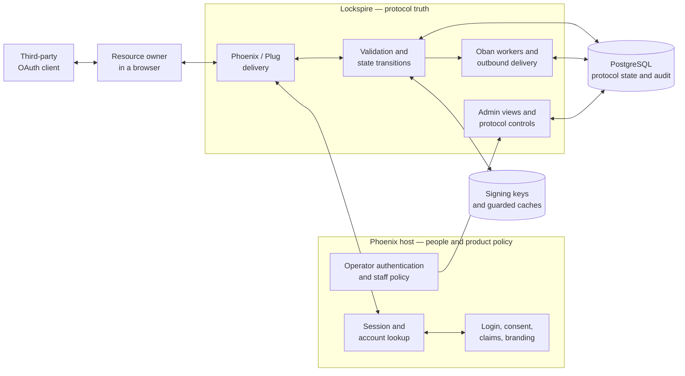
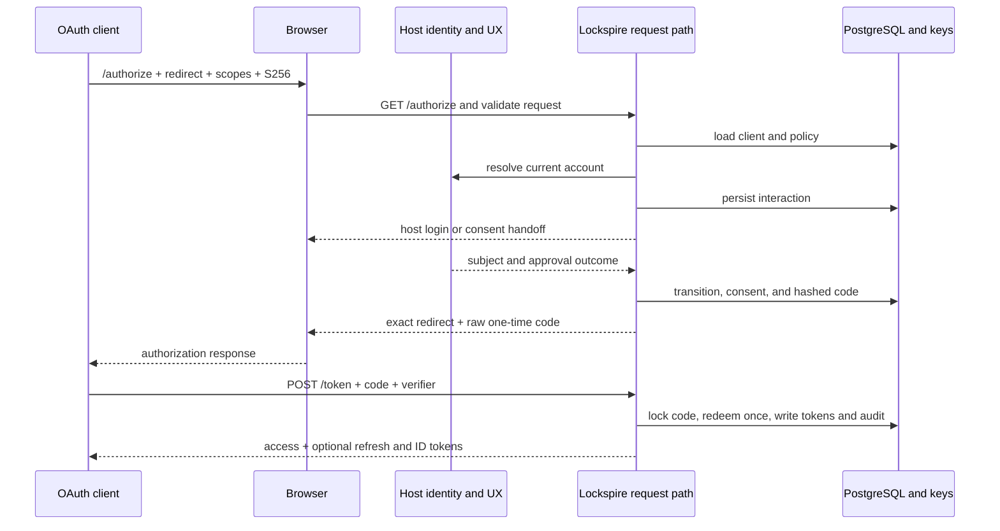
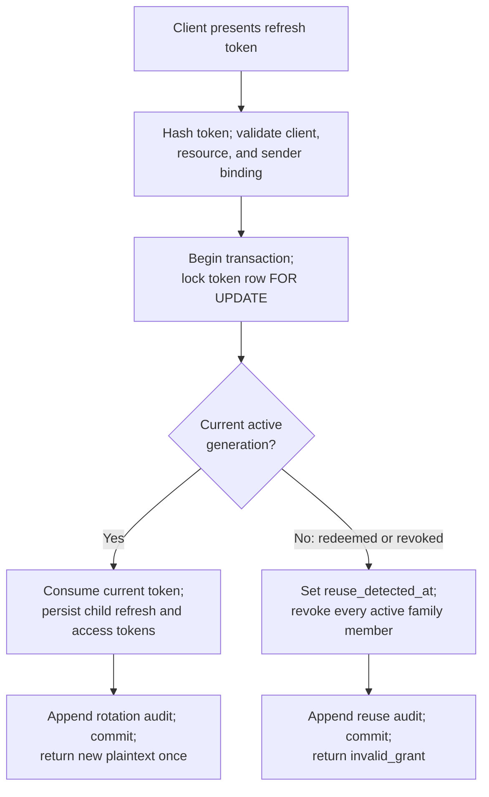
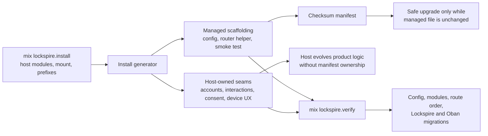

# Lockspire Architecture

Lockspire turns an existing Phoenix application into an OAuth 2.0 and OpenID
Connect provider without turning the application into a client of a separate auth
service.

The shortest useful description is:

> **Lockspire owns protocol truth; the Phoenix host owns people and product
> policy.**

Lockspire validates OAuth/OIDC requests, records protocol state, issues and
rotates tokens, manages signing material, and exposes evidence to operators. The
host application decides who the person is, how they sign in, which product
rules apply, what consent means, which claims are safe to expose, and who may
enter the operator UI.

This guide builds a mental model for tracing an authorization request or refresh
through those two authorities. If provider-side OAuth is new to you, scan
[OAuth/OIDC for Phoenix adopters](oauth-oidc-for-phoenix-adopters.md) first.

## Lockspire in one picture



The diagram has two trust boundaries, not one. The network boundary separates
clients and browsers from the embedded provider. The ownership boundary inside
the host separates product facts from protocol facts. Passing an account into a
Lockspire callback does not transfer ownership of that account. Persisting an
interaction or token does transfer responsibility for that protocol fact to
Lockspire.

The admin UI follows the same rule. It is a view and control surface over
Lockspire-owned records. The host must authenticate and authorize the operator
before forwarding a request to it.

## Vocabulary for the trip

An **authorization server** validates a client's request and issues tokens.
Lockspire is that server, embedded in the host.

A **client** is the third-party application asking for access. The **resource
owner** (or subject) is the person approving access. A **resource server** is the
API that accepts the resulting access token; it can be the same Phoenix host.

The **issuer** is Lockspire's exact public identity, such as
`https://accounts.example.com`. A **redirect URI** is the exact registered
destination to which Lockspire may send the browser. It is never matched by
prefix or “close enough” normalization.

A **scope** names a kind of access. An **audience** or OAuth **resource** names
the API for which an access token is intended. The host assigns product meaning
to both; Lockspire validates and carries the resulting protocol facts.

An **interaction** is Lockspire's durable record of browser work still in
progress. A **consent grant** records an approval that policy may reuse. Neither
record is a host login session.

An **authorization code** is a short-lived, single-use credential that crosses
the browser. An **access token** calls an API. A **refresh token** obtains a new
token set without repeating the browser interaction. An **ID token** tells the
client what the issuer asserts about the authenticated subject.

**PKCE** binds the authorization code to a secret verifier held by the client.
Lockspire requires the SHA-256 form, S256, by default.

## Journey 1: an authorization request becomes tokens

The primary path starts at `/authorize`, leaves Lockspire only for host-owned
identity and consent decisions, then returns to `/token` for a bound exchange.



### 1. Validation establishes redirect safety

`Lockspire.Web.AuthorizeController` is a delivery adapter. It passes request
parameters to `Lockspire.Protocol.AuthorizationRequest` before it asks the host
about a person.

That ordering matters. A missing or unknown client, or a missing or unregistered
redirect URI, produces a browser-safe error. Lockspire does not redirect to an
untrusted URI. Only after exact redirect validation can later failures become
redirect-safe OAuth errors.

The validated value carries the client, exact redirect URI, scopes, resources,
prompt, nonce, state, response mode, and S256 challenge. Optional PAR, JAR, and
security-profile policy can refine how that value is reached, but the ordinary
authorization-code path still converges on the same canonical state.

### 2. The host supplies a subject, not a protocol decision

The account resolver is the narrow authority seam. Its real shape is a behavior,
not a shared account schema:

```elixir
@callback resolve_current_account(connection(), context()) ::
            {:ok, account()} | {:redirect, InteractionResult.t()}

@callback build_claims(account(), context()) ::
            {:ok, Claims.t()} | {:error, term()}

@callback redirect_for_login(connection(), context()) ::
            InteractionResult.t()
```

The host may read a Phoenix session, a `current_scope`, or another established
identity source. It returns an account or a login handoff. It also supplies a
stable subject identifier and permitted identity claims. Lockspire never gains
authority over tenant membership, billing rules, staff roles, or object-level
authorization merely because those facts exist on the account.

### 3. The interaction makes browser work durable

`Lockspire.Protocol.AuthorizationFlow` turns the validated request and current
subject context into one of a few durable states:

```elixir
@type status ::
        :pending_login | :pending_consent | :completed | :denied | :expired
```

The interaction stores the original client, redirect URI, scopes, resources,
PKCE challenge, nonce, prompt, state, and expiry. It also records login and
consent transitions. That is why a host login redirect can safely leave the
protocol code and later resume by interaction ID.

The host owns the login page and the human explanation of consent. Lockspire
owns whether a request requires login, whether prior consent is reusable,
whether the interaction can legally move to its next state, and which evidence
is committed with that transition. `prompt=none` demonstrates the distinction:
Lockspire can return `login_required`, `consent_required`, or
`interaction_required` without invoking UI when durable facts do not justify a
silent result.

### 4. Approval exposes plaintext only at the boundary

On approval, Lockspire generates an authorization code, hashes it for storage,
and puts the raw value only on the response redirect. The record binds the code
to the client, redirect URI, subject, consent, scopes, audience, and S256
challenge. It expires quickly and can be redeemed only once.

### 5. The token endpoint proves all bindings again

The client posts the code and original PKCE verifier directly to `/token`.
`Lockspire.Protocol.TokenExchange` authenticates the client when required,
resolves any sender constraint, loads the code by its hash, and checks:

- the code is active and unredeemed;
- the client and exact redirect URI match the authorization request;
- the S256 verifier matches the stored challenge;
- any requested resource remains within the authorized audience.

Redemption locks the code row and persists the access token in the same
transaction. When a refresh token is allowed, its family starts at generation
zero. ID-token claims combine protocol-owned values such as `iss`, `aud`,
`nonce`, and `auth_time` with the host's restricted claim material. Access-token
format is resolved by client policy, then server policy, then the JWT default.

## Journey 2: refresh rotation contains compromise

A refresh token family is a lineage, not a bag of interchangeable credentials.
Each successful rotation consumes one generation and creates the next. A replay
of an ancestor is evidence that two parties may possess the family.



The transaction is the security feature. The row lock serializes two presenters
of the same generation. The winner consumes the token and persists its children.
The loser observes a redeemed or revoked ancestor, marks reuse, revokes every
active member with the same family ID, and receives `invalid_grant`.

Sender constraints are part of the same binding. A DPoP- or mTLS-bound family
must preserve the expected `cnf` value across its children. A mismatched proof
fails without mutating the family.

The failure is durable, not merely a log line. Lockspire commits the reuse fact,
family revocation, and audit events together. Redacted telemetry then signals
the operation without becoming the source of truth.

## Installation draws the ownership line

Installation is a smaller version of the runtime architecture: inputs cross a
boundary, files acquire owners, and later verification checks the assembled
host.



The generated config declares the runtime contract explicitly:

```elixir
config :lockspire,
  repo: MyApp.Repo,
  account_resolver: MyApp.Lockspire.AccountResolver,
  issuer: "https://accounts.example.com",
  mount_path: "/lockspire",
  storage_prefix: "lockspire",
  oban_prefix: "lockspire"
```

Managed files are checksummed in the install manifest. `mix lockspire.upgrade`
can replace one only when it still matches the recorded content. Account,
interaction, consent, device-verification, layout, branding, and product-policy
seams are generated once and remain host-owned. Rerunning installation refuses
to overwrite a modified file.

Route order is security-sensitive. The host-owned `/verify` surface stays under
the host's browser and account protections. The admin router stays behind the
host's operator pipeline and must be mounted before the general public Lockspire
forward. Verification also checks that both Lockspire and its Oban runtime point
at applied migrations in the configured prefixes.

The current generated resolver's explanatory error text contains a stale
illustrative `%Claims{claims: ...}` shape. The actual `Lockspire.Host.Claims`
contract uses separate `id_token` and `userinfo` maps. Implement the behavior's
real struct contract; do not copy that stale illustration into host code.

For the operational sequence, use [Install and onboard](install-and-onboard.md)
and [Getting started](getting-started.md).

## Security is the architecture

Lockspire's component boundaries exist to make these invariants enforceable:

| Invariant | Architectural consequence |
| --- | --- |
| Required runtime identity | Repository, resolver, issuer, mount, and Oban configuration fail early rather than during a partial grant. |
| Safe redirects | Client lookup and exact redirect matching happen before an OAuth error may leave through that redirect. |
| PKCE S256 by default | The canonical authorization value always carries an S256 challenge, and token exchange checks the verifier. |
| Bounded plaintext | Client secrets, authorization codes, and opaque tokens are hashed at rest; raw values exist only at creation and presentation edges. |
| Single-use credentials | Codes and refresh generations are redeemed under row locks and transactions. |
| Atomic evidence | Security-sensitive state changes and their durable audit records share a transaction when the store supports it. |
| Sender binding | `cnf`, DPoP proof state, and mTLS certificate facts are validated at the token or protected-resource boundary. |
| Key control | Client input cannot choose `alg=none`; active server keys determine signing algorithm and key ID. |
| Redacted operations | Logs, telemetry, and operator surfaces do not expose raw credentials or unsafe request bodies. |
| Bounded support | Readable code and implemented advanced modules do not expand the [supported surface](supported-surface.md). |

Validation order prevents a common OAuth bug: returning an error to a redirect
URI that was never proven safe. Transaction boundaries prevent another: marking
a code consumed without persisting the token, or persisting refresh children
without consuming their parent.

PostgreSQL constraints and locks are necessary but not sufficient. Lockspire
defines which rows must move together and which old states are security events.

## The data model carries protocol state

The model is easier to remember as clusters of facts than as tables.

**Runtime and registration facts** bind an issuer, mount, repository, server
policy, and registered clients. Client records hold redirect URIs, allowed grant
and response types, scopes, authentication method, sender-constraint posture,
and optional advanced-protocol settings. Secret material is stored as hashes or
encrypted key material where appropriate.

**Human-interaction facts** connect a validated authorization request to a
subject and consent decision. Interactions move through pending login, pending
consent, completed, denied, or expired. Consent grants record reusable approval;
the host still owns the product meaning and presentation.

**Credential facts** connect authorization codes, access tokens, refresh
families, and signing keys. Timestamps such as `redeemed_at`, `revoked_at`, and
`reuse_detected_at` make lifecycle decisions inspectable. Family IDs,
generations, parent IDs, and `cnf` values make lineage and sender binding
explicit.

**Replay and advanced-flow facts** include used JWT IDs, DPoP proofs, pushed
authorization requests, device and CIBA authorizations, and logout events with
delivery attempts. These records exist where accepting the same value twice or
losing an off-request transition would violate protocol truth.

**Audit facts** are append-only incident evidence with action, outcome, reason,
actor, resource, and redacted metadata. They are distinct from telemetry events,
which help operate the system but are not its durable state.

## Cross-cutting mechanics

### Configuration and supervision

`Lockspire.Config` resolves required host modules and validates issuer, mount,
and signing posture. `Lockspire.Application` supervises the named Oban runtime,
the remote-JWKS cache, and the signing-key cache. The Phoenix host still
supervises its repository and endpoint.

### Storage and transactions

Storage behaviors describe the operations the protocol needs. The Ecto
repository implements them with records, constraints, configured PostgreSQL
prefixes, `FOR UPDATE` locks, and transactions. This boundary keeps protocol
coordinators focused on valid transitions while making atomicity explicit.

### Signing and guarded caches

JOSE supplies JWT/JWK cryptography and JCS supplies canonical JSON where the
protocol requires it. Lockspire chooses allowed algorithms, claim shapes,
bindings, and key lifecycle. Cachex and the key cache reduce repeated key work;
Req supports guarded remote JWKS fetches. Lockspire still owns target safety,
last-known-good behavior, refresh posture, and failure diagnostics.

### Audit and telemetry

The `:telemetry` library and OpenTelemetry integration expose redacted
operational events. `Lockspire.Observability` defines names, measurements, and
metadata filtering. Durable audit records are normalized separately and are
written with security-sensitive state where atomic evidence matters. See
[Telemetry](telemetry.md) for event consumption.

### Asynchronous work

Oban provides durable off-request execution. Req provides HTTP delivery. Jobs
such as pruning, CIBA notification, and back-channel logout still need
Lockspire-defined payloads, retry-safe behavior, lifecycle transitions, and
audit evidence. Front-channel logout remains best-effort browser choreography;
back-channel delivery is the durable path.

### Operator surfaces

Phoenix LiveView renders protocol records and supported controls. The host
authenticates operators and applies staff, MFA, IP, and tenant policy before the
admin router. Phoenix LiveDashboard is an optional observation surface, not a
required control plane. See [Operator and admin](operator-admin.md).

### Protected host APIs

The canonical pipeline is `Lockspire.Plug.VerifyToken`, then
`Lockspire.Plug.EnforceSenderConstraints`, then
`Lockspire.Plug.RequireToken`. It establishes token protocol facts and fails
closed if a bound token reaches enforcement without a verified proof. The host
then applies business authorization and tenant policy. Use
[Protect Phoenix API routes](protect-phoenix-api-routes.md) for exact setup.

## Advanced protocols orbit the core

The advanced surfaces extend the same client, validation, state, token, key,
storage, and audit boundaries:

- PAR changes how the validated authorization request arrives; JAR protects its
  representation; JARM protects the authorization response.
- FAPI profiles make selected baseline options mandatory and add stricter
  algorithm, PAR, redirect, and sender-constraint policy.
- Dynamic client registration changes how client records are created and
  managed, not who owns product policy.
- Device Flow and CIBA create different authorization state machines but
  converge on the shared token issuance boundary.
- Token exchange adds a host validator for delegation policy while Lockspire
  owns the RFC-shaped grant and token facts.
- DPoP and mTLS bind tokens to a presenter and add proof or certificate facts to
  issuance and protected-resource checks.
- Logout propagation connects session identifiers to durable back-channel work
  and best-effort front-channel notification.

These are supported only as described in the [supported surface](supported-surface.md).
For task-level integration, see [Dynamic registration](dynamic-registration.md),
[Device Flow](device-flow-host-guide.md), [private key JWT](private-key-jwt-host-guide.md),
[client secret JWT](client-secret-jwt-host-guide.md), and
[RAR consent](rar-consent-host-guide.md).

## Module atlas

| Question | Start here | Then inspect |
| --- | --- | --- |
| What must the host configure and supervise? | `Lockspire.Config`, `Lockspire.Application` | `Lockspire.Oban`, `Lockspire.KeyCache` |
| How does installation assign ownership? | `Lockspire.Generators.Install` | `Lockspire.Install.Manifest`, `Lockspire.Install.Verify` |
| Where do HTTP routes enter? | `Lockspire.Web.Router` | The matching web controller or LiveView |
| Why was an authorization request rejected? | `Lockspire.Protocol.AuthorizationRequest` | `Lockspire.Protocol.ParPolicy`, `Lockspire.Protocol.SecurityProfile` |
| How does login or consent advance? | `Lockspire.Protocol.AuthorizationFlow` | `Lockspire.Domain.Interaction`, `Lockspire.Domain.ConsentGrant` |
| How are codes and tokens exchanged? | `Lockspire.Protocol.TokenExchange` | `Lockspire.Protocol.ClientAuth`, `Lockspire.Protocol.AccessTokenSigner`, `Lockspire.Protocol.IdToken` |
| How is refresh compromise contained? | `Lockspire.Protocol.RefreshExchange` | `Lockspire.Storage.TokenStore`, `Lockspire.Storage.Ecto.Repository` |
| How are resource requests enforced? | `Lockspire.Plug.VerifyToken` | `Lockspire.Plug.EnforceSenderConstraints`, `Lockspire.Plug.RequireToken` |
| Where are operational and incident facts emitted? | `Lockspire.Observability` | `Lockspire.Redaction`, `Lockspire.Audit.Event` |
| What can an operator see or change? | `Lockspire.Admin` | `Lockspire.Web.AdminRouter`, the matching admin LiveView |

## Code-reading routes

Choose a route by question rather than reading the tree alphabetically.

**Install ownership:** `Lockspire.Generators.Install` →
`Lockspire.Generators.Templates` → `Lockspire.Install.Manifest` →
`Lockspire.Install.Verify`.

**Authorization:** `Lockspire.Web.AuthorizeController` →
`Lockspire.Protocol.AuthorizationRequest` →
`Lockspire.Protocol.AuthorizationFlow` → `Lockspire.Domain.Interaction`.

**Code and refresh exchange:** `Lockspire.Web.TokenController` →
`Lockspire.Protocol.TokenExchange` → `Lockspire.Protocol.RefreshExchange` →
`Lockspire.Storage.TokenStore` → `Lockspire.Storage.Ecto.Repository`.

**Keys and client authentication:** `Lockspire.Protocol.ClientAuth` → the
selected authentication method → `Lockspire.Protocol.AccessTokenSigner` →
`Lockspire.Protocol.Jwks` and the key store.

**Protected resources:** `Lockspire.Plug.VerifyToken` →
`Lockspire.Plug.EnforceSenderConstraints` → `Lockspire.Plug.RequireToken`.

**Advanced protocols:** enter at the matching controller or coordinator, then
look for its domain record, storage behavior, repository transaction, and audit
events. The repeated shape is intentional.

**Operator workflow:** enter at `Lockspire.Web.AdminRouter`, follow the LiveView
to `Lockspire.Admin`, then follow the delegated domain or storage operation.

The companion [code walkthrough](code-walkthrough.md) follows the first three
routes with representative source excerpts.

## Changing Lockspire safely

Start with the invariant, not the endpoint. Identify the durable fact being
changed, its owner, the row or key that serializes concurrent work, and the
evidence that remains after failure.

Pair changes with tests at the boundary they affect:

- authorization validation tests for browser-safe versus redirect-safe errors,
  exact redirect matching, and S256 policy;
- authorization-flow tests for login, consent, silent-mode, expiry, and
  duplicate finalization transitions;
- token-exchange tests for client, redirect, verifier, resource, signing, hash,
  single-use, and audit behavior;
- refresh tests for row-locked rotation, sender binding, reuse detection, family
  revocation, and audit atomicity;
- integration tests for the actual mounted HTTP journey and generated host
  ownership seam.

Do not promote an internal helper to supported API merely because a guide can
name it. Do not weaken redaction to make a test easier to debug. Do not split a
security-sensitive transaction without deciding what contradictory durable
state becomes possible.

## Where to go next

Read the [code walkthrough](code-walkthrough.md) to see values move through the
modules named here. Then use [Getting started](getting-started.md) or
[Install and onboard](install-and-onboard.md) to assemble a host, and keep the
[supported surface](supported-surface.md) open when deciding what production
shape Lockspire promises.
